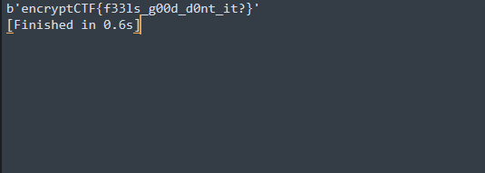

# Journey to the centre of the file 2

## Task


[ziptunnel2](./src/ziptunnel2)

## Solution

First, I look at this file through 010Editor:


So the file compressed with bzip2. Here's a script to decompress it:

```Python
import bz2

with open('ziptunnel2', "rb") as f:
	data = f.read()

data = bz2.decompress(data)

with open("flag", "wb") as f:
	f.write(data)
```
Decompressing gives us following file:


That's zip. Decompressing it will give us gzip file. If we decompress it we will get bz2 file and so on. So decompress it without automation will last too long. That's why I wrote the following script:

```Python
import gzip
import bz2
import zipfile

while 1:
	try:
		with zipfile.ZipFile("flag") as z:
			z.extractall()
	except:
		with open("flag", "rb") as f:
			data = f.read()
			try:
				data = gzip.decompress(data)
				with open("flag", "wb") as f:
					f.write(data)
			except:
				try:
					data = bz2.decompress(data)
					with open("flag", "wb") as f:
						f.write(data)
				except:
					print(data)
					break
```
And here we go: 


Flag: `encryptCTF{f33ls_g00d_d0nt_it?}`