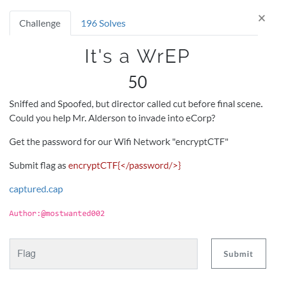

# WrEP

## Task

[captured.cap](./src/encryptCTFWEP.cap)

## Solution

Just feed it to `aircrack-ng` and you will get the password:

<pre><b>root@kali</b>:<b>/mnt/hgfs/Shared/Encrypt</b># aircrack-ng encryptCTFWEP.cap
Opening encryptCTFWEP.cap
Read 546320 packets.

   #  BSSID              ESSID                     Encryption

   1  58:D7:59:79:61:34  MCSP                      No data - WEP or WPA
   2  40:31:3C:E6:CA:3C  Malik’s                 WPA (1 handshake)
   3  14:CC:20:F5:32:FE  encryptCTF                WEP (88648 IVs)
   4  0C:D2:B5:72:3C:D4  home                      WPA (0 handshake)
   5  E4:6F:13:80:82:99  prime2                    No data - WEP or WPA
   6  04:95:E6:05:50:60  Letzpay1                  WPA (0 handshake)
   7  C4:B8:B4:BF:5B:C8  foresightinn              No data - WEP or WPA
   8  B4:EF:FA:51:EC:53  Le 2                      No data - WEP or WPA
   9  72:B7:AA:33:56:23  vivo 1802                 None (0.0.0.0)
  10  78:D3:8D:E4:E5:8C  Sarovar                   None (172.16.168.188)
  11  50:5D:AC:94:3D:E4  Webnyxa_airtel_12G        No data - WEP or WPA
  12  C4:B8:B4:4D:93:74  Webnyxa_airtel_first      No data - WEP or WPA
  13  C8:D7:79:A7:E0:0A                            Unknown
  14  B0:C1:9E:A3:18:BA  Airtel-Hotspot-18BA       WPA (0 handshake)
  15  C4:B8:B4:A8:92:20  sanchez                   No data - WEP or WPA
  16  74:DA:DA:D8:86:77  Orium                     WPA (0 handshake)
  17  AC:EE:9E:91:D3:43  AndroidAP                 No data - WEP or WPA
  18  AE:56:2C:96:57:C9                            Unknown
  19  84:FE:DC:DC:8C:06  password                  No data - WEP or WPA
  20  04:B1:67:C2:3D:87  Redmiamit                 No data - WEP or WPA
  21  70:5A:AC:92:B9:BC  Ritesh mobile             No data - WEP or WPA

Index number of target network ? 3

Opening encryptCTFWEP.cap
Attack will be restarted every 5000 captured ivs.
Starting PTW attack with 88648 ivs.

                                 Aircrack-ng 1.2 rc4

                 [00:00:00] Tested 837 keys (got 85909 IVs)

   KB    depth   byte(vote)
    0    0/ 17   57(107520) 84(99840) 71(97536) B5(97536) D0(96512) 
    1    0/  1   C4(116992) DD(98816) 1A(97792) 3A(96768) 59(94720) 
    2    2/  2   3E(101632) 4D(98816) 9B(97536) 2B(96256) 5E(96000) 
    3   13/  3   C5(93952) B6(93440) 63(93184) 72(93184) B8(92928) 
    4    0/  1   98(121344) F8(98048) C2(97536) C1(97280) D4(96000) 

     KEY FOUND! [ 57:34:35:5F:31:37:5F:52:33:34:4C:3F:21 ] (ASCII: W45_17_R34L?! )
	Decrypted correctly: 100%

</pre>

Flag: `encryptCTF{W45_17_R34L?!}`