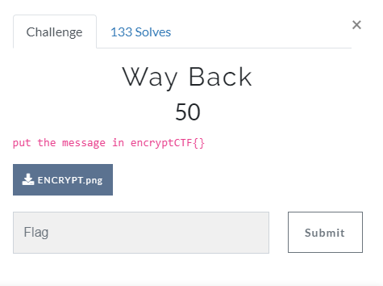
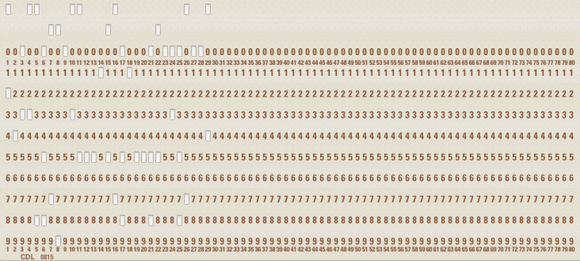
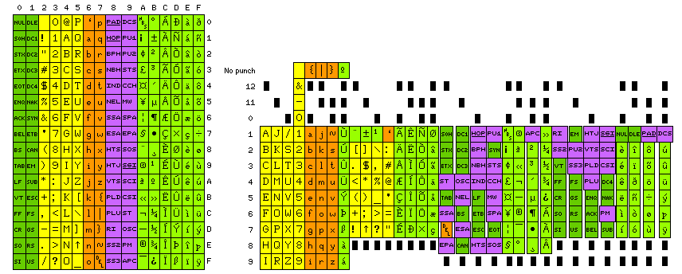

# Way Back

## Task

[ENCRYPT.png](./src/ENCRYPT.png)

## Solution

So we have the punch card:

All we need to do is to find how to read this. A bit googling and here u go: http://www.quadibloc.com/comp/cardint.htm
I decoded the punch card using this pic:

And I got this string: `B4TCH_PR0CE551NG_155_N0T_G00D`

So the flag is: `encryptCTF{B4TCH_PR0CE551NG_155_N0T_G00D}`
