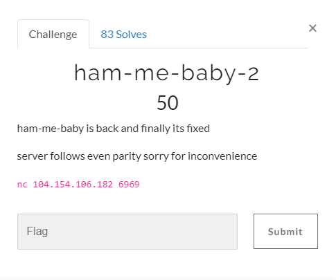
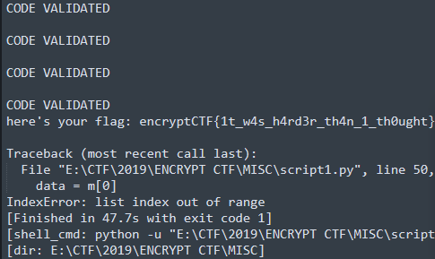

# ham-me-baby-2

## Task



## Solution

Connecting to the server gives us this:
<pre>                        Welcome To 

     ____                       __    _______________  
    / __/__  __________ _____  / /_  / ___/_  __/ __/  
   / _// _ \/ __/ __/ // / _ \/ __/ / /__  / / / _/    
  /___/_//_/\__/_/  \_, / .__/\__/  \___/ /_/ /_/      
                ___/___/_/_____                        
               |_  |/ _ &lt;  / _ \                       
              / __// // / /\_, /                       
             /____/\___/_//___/                        
                                                         

you will be receiving hamming(7,4) codes. your job is to send data bits
from a 7 bit hamming code. 
 ___________________________________________________________________
|                                                                   |
|   DO YOUR RESEARCH : https://en.wikipedia.org/wiki/Hamming(7,4)   |
|  FLAG WILL BE PRINTED AFTER YOU SEND CORRECT DATA BITS 100 TIMES  |
|___________________________________________________________________|

               the order of the bits followed is

                    P1 P2 D3 P4 D5 D6 D7


and come back here. remember somebits could be flipped. you need to send
correct data bits.

[*] CODE: 0110000
[*] DATA:</pre>

So the task is actually to write a little script to recover data from hamming(7,4) code. A little bit googling and I have found this site: https://studylib.net/doc/8184421/hamming--7--4--3--code---cs1001.py

Using this code I wrote following script:

```Python
import socket
import re

def hamming_decode(y1,y2,y3 ,y4,y5,y6 ,y7):
    """  Hamming  decoding  of the 7 bits  signal  """
    b1= (y1+y3+y5+y7) % 2
    b2= (y2+y3+y6+y7) % 2
    b3= (y4+y5+y6+y7) % 2
    b=4*b3+2*b2+b1 
    # the  integer  value
    if b==0 or b==1 or b==2 or b==4:
        return (y3,y5,y6 ,y7)
    else:
        y=[y1,y2 ,y3,y4,y5 ,y6,y7]
        y[b-1]=(y[b -1]+1) % 2   # correct  bit b
        return (y[2],y[4],y[5],y[6])

s = socket.socket()
s.connect(("104.154.106.182", 6969))

print(s.recv(1024).decode())
print(s.recv(1024).decode())
data = s.recv(1024).decode()
pattern = re.compile("[01]{7}")
m = pattern.findall(data)

data = m[0]
ready = []

for i in data:
    ready.append(int(i))
print(data)
answer = b''
resp = hamming_decode(*ready)
for i in resp:
    if i == 1:
        answer += b"1"
    else:
        answer += b"0"
answer += b"\n"

while 1:
    s.send(answer)
    data = s.recv(1024).decode()
    m = pattern.findall(data)
    if len(m) == 0:
        print(data)
        data = s.recv(1024).decode()
        m = pattern.findall(data)
    data = m[0]
    ready = []
    for i in data:
        ready.append(int(i))
    resp = hamming_decode(*ready)
    answer = b""
    for i in resp:
        if i == 1:
            answer += b"1"
        else:
            answer += b"0"
    answer += b"\n"

```

Run this and here we go:


Flag: `encryptCTF{1t_w4s_h4rd3r_th4n_1_th0ught}`