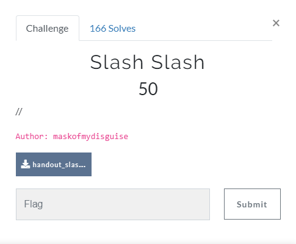
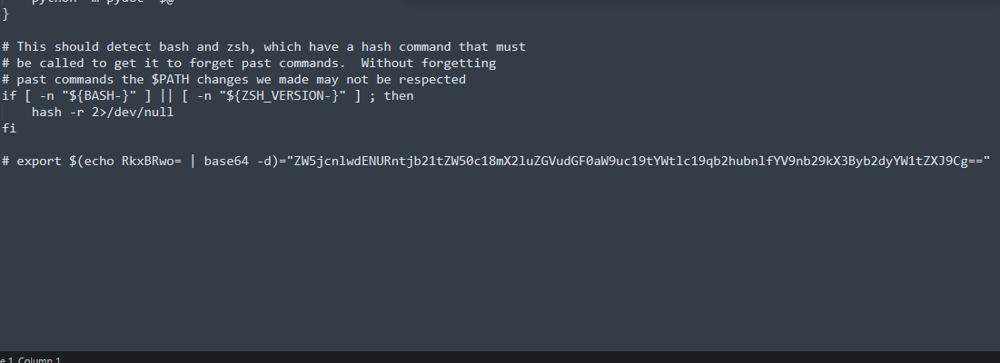

# Slash slash

## Task

[handout_slashslash.7z](./src/handout_slashslash.7z)
## Solution

Extracting file will give us folder with web application. I think, author thought we will run this, but all I did is looked through files. In the app/env/bin/activate file I found this:

And I tried to decode base64 and here is the flag:
`encryptCTF{comments_&_indentations_makes_johnny_a_good_programmer}`