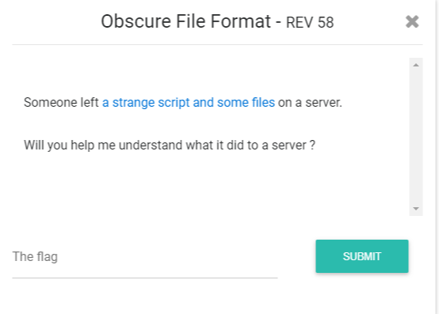
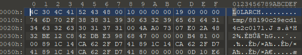
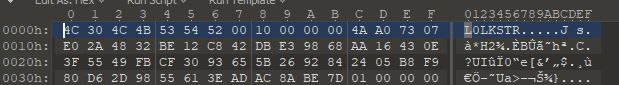
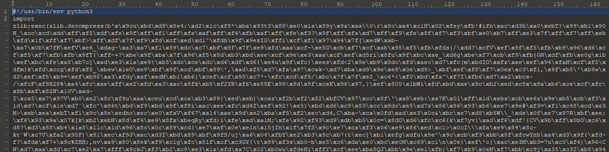
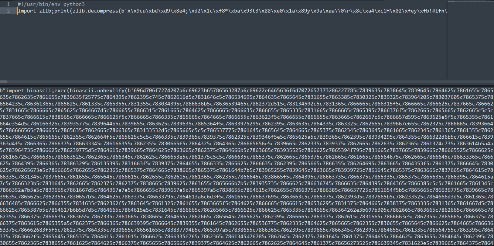

# Obscure File Format

## Task



[obscure-file-format.zip](./src/obscure-file-format.zip)

## Solution
---

### Understanding archive

Unpacking archive gives me three files: a, k and l. I open them with 010Editor to find out what are these files. a and k have strange headers and l file is the Python script.

a:



k:



l:



Let's look at the script closer:

```Python
#!/usr/bin/env python3
import zlib;exec(zlib.decompress(<long_string_of_bytes>))
```

Script executes decompressed bytes. I change `exec` to `print` to look what code is being executed:



And again I have hex string, which being executed after unhexlify. I again change `exec` to `print` and get `zlib.decompress` again. That's just annoing... But after doing this:

```Python
#!/usr/bin/env python3
import zlib
s = zlib.decompress(<long_string_of_bytes>)

s = s.replace(b"exec", b"s1 = ")
exec(s)
print(s1)
s1 = s1.replace(b"exec", b"s2 = ")
exec(s1)
#print(s2)
s2 = s2.replace(b"exec", b"s3 = ")
exec(s2)
#print(s3)
s3 = s3.replace(b"exec", b"s4 = ")
exec(s3)
#print(s4)
s4 = s4.replace(b"exec", b"s5 = ")
exec(s4)
print(s5.decode())
```

I finnaly get the real code:

```Python

import os as _4491ba09efd64d32a7c316a89ed23540
import uuid as _9c0223fbd33e432cad291e3626fa8375
import zlib as _75efb4b5390e450f86339bb370cf9798
import struct as _460dcfe1367b4351bfd11161e6afb4bc
import random as _93208a26d2354ca58a2d63a1775b429e
import pathlib as _fc2e6885d4f6459c9173119853a9b941
import argparse as _d80254fe3b7f406a91ec7ea2a813e6ee
import cryptography.hazmat.backends as _95637ffc24f64183a0e5cab581866201
import cryptography.hazmat.primitives.ciphers as _12fe06755daf4d66ac222ee97d41fa8f
_d92c89d5c8e6480ab83f62d04ac6968e = zip
_2a054c268d044e6ab9b9ba49b0c99ac2 = vars
_efe18136e1d14a66b014f121b6cdc599 = type
_9013c61b775f4709917f60cfb4c4d0bd = tuple
_c78251a8b4ef4e5c975562404153eca2 = super
_05314ca66c8241329018829d41388221 = sum
_edce3f96a97f4268b7f758ebbee92e39 = str
_f1216e22142a40e6b2f2bef9bad97dc8 = staticmethod
_db7a1923e60b407e8946626fbda97a39 = sorted
_d3cfb7be150c4d6b9165bd6b4f256280 = slice
_777f2cfa06f040478891a09e204ce442 = setattr
_419debbaf6fa40fe8eed1a33ff7b5054 = set
_c0bd2003dfbd4a949b356f6691484af0 = round
_b95dfc84bafb470689533c3746352ddb = reversed
_a011ae99a45b40099121c0fd1a164aab = repr
_3fa9f86ba17f44e7b990bb639c51f3bf = range
_5a9ea9db9e3443f4ab9f4e2e7172d69f = quit
_0aa77fc2a6db4be4b58865ae4d13913a = property
_7337aa3caf7c4d9f855a7a241a9db8be = print
_639a2e6f41b041688856eac61a7ef244 = pow
_c4754cee9f0f4a5186b99594618a9117 = ord
_a66abde4ce3048488263de1cf9695616 = open
_31a7f57a7890416bbfdfa14fac4b4494 = oct
_0614c181390346469e56dd3c5cc69382 = object
_4dc860aba19640d18df6a9fa82ea8812 = next
_5b7d659104324bb6b5174effb661c82c = min
_2a279817dc8d4df19368574962ec6989 = memoryview
_4fd1101920684bd3927e0078ffb7d058 = max
_5dbd8f8702d54135af11719ac747cfe2 = map
_7cfbebcc486f4728be51e3a5d1f71647 = locals
_348deb41107f440ea6e05f9eda40e243 = list
_c87f53df47af43549034cffa618848db = license
_c8ab51b417d843f8982ae6704e9764b7 = len
_2bd4fb19079542f5af4f05eadb9daba3 = iter
_e2a25b47df0e4314bfd8f6ffe9046488 = issubclass
_81359519d9044e34873e4053c9463167 = isinstance
_f10babe329654a188b28f15547ad4266 = int
_e3c36eecddfc40808308f7ac76f7e3da = input
_3b194946a125498bb9bee24a49474cdd = id
_ea130bd1ad0c4582b7bbfffcede80554 = hex
_65c9b6af369543f5a71b061ff59d96c8 = help
_e2fa667106eb4c60b93fe4229ea6d139 = hash
_72892c873557438e8eb844be66a3ff85 = hasattr
_e0fc264a76004088918712d418a5e58f = globals
_522c60ce347148b48ebad87bf7068b52 = getattr
_899c6496c4b44e4391a948383a48fada = frozenset
_0e010ed24c9943e0b9013beb5fc4ccf3 = format
_51b28eae00284b80a9defd2e01091ded = float
_e6701fe56f97478aae26772cabfcd254 = filter
_3c391a07ac7e477693cf839aebb7f398 = exit
_f848d99ec4e944bea232e5030c19a95a = exec
_aa2bcc1974fa4423b2050897cd493316 = eval
_b2261f5204dc405292771a0b6133b2a2 = enumerate
_ddb7c8ba43364282bbca52e4ec4da69d = divmod
_0bafc82047ed441eb6d2ce8aedb627b8 = dir
_b03bf30bc9934bbc94a982a98e62d177 = dict
_997004a17c604134a99ff104997794d5 = delattr
_346d22a2f78b490eb4abf1776039ac93 = credits
_d18ec62a1b564a37aca192701c307993 = copyright
_25b999825d284b07a1177f207e00f46b = complex
_2030c6bde0b04af28e1b6c2ac1994c03 = compile
_24c6add9b5f643b7af9ac9adc7a8f88e = classmethod
_6eae669a5caa49d3b2cf0ca94f1db62a = chr
_7e5a105ca35c401f8baf2399f841bf48 = callable
_6437cd5ae5444b6ea6b5517489961678 = bytes
_b17c67f75d1f4950b5d9bf1b9bae0977 = bytearray
_0d8659b28a63481797b57a6cbd45979b = breakpoint
_16d9ebd528c54cfcab70919505c51c47 = bool
_093c82ee06b04c548518d151aadeff09 = bin
_9ec3c131d0704d198077b653f534f2e3 = ascii
_a5eadde352fc4e9185c23382c6609d05 = any
_478d1f17762441ffbcdf51ad03452e5e = all
_6e47d9017bfc4bb0b457e8fc7d37e061 = abs
_c003e61a683c4d48992c5968730f88de = __spec__
_120f0ca155a54f17b3a8a7139481d201 = __package__
_0725a4328dac4b608bca988314e49535 = __name__
_d04e26a1c11b42e6b6d4a19928378a10 = __loader__
_0afcf66370f24a46833b16ad68e51f33 = __import__
_936c716b36354788811726a511d820be = __doc__
_55b22c1393fd4ddb92e5b741516a9b49 = __debug__
_2fa87f4a68a34d7585f804c2d1f41d8b = __build_class__
_98fc8056914d49c18cfc6f2219605829 = ZeroDivisionError
_e0c1d917c66d4bf9bff6985270d24836 = Warning
_c1f0aa22b0414c10a669df1dd85dcc5b = ValueError
_d6198e1bf52740108a3a42c6aad41bb4 = UserWarning
_f751b328ae0f485981b8bd5eb4e9bce9 = UnicodeWarning
_7dec97b6daf0458894941228aca1bfb1 = UnicodeTranslateError
_4268dd7edaf9417fa43e9be4aab0cd79 = UnicodeError
_d847bf32c8704332ace814998a0b55fc = UnicodeEncodeError
_0e36ecc15fd84c75a50b8f59ff5a5633 = UnicodeDecodeError
_6f42769b59284276b9847cf82cb9e732 = UnboundLocalError
_23325e647bc447be86fdde3963c18734 = TypeError
_33186cdf76944c1d8b235829cede199b = True
_d021c6575bbc469cb3dc2a7be381022d = TimeoutError
_014da739ca3a4b06be1a815eb0fd2bc0 = TabError
_9385ba93ab3d4765b062e08dee9baf24 = SystemExit
_ebc7db66319b4ba1a5a7865325d86019 = SystemError
_b7ebf253050d4e67813b1fba8ca241c1 = SyntaxWarning
_8243d700f5e5400c9e6ffa38f41fe0b7 = SyntaxError
_77d15c4c7fe74e309d9141093345fc8f = StopIteration
_e1d49ccdec594d3683ddef929fb2de1d = StopAsyncIteration
_831260914b4548099ba08b15626ef911 = RuntimeWarning
_8efed85bd266402d96f4aa0c69ca8148 = RuntimeError
_66a9c8f0a7d9470d944ee5e14ab8e79d = ResourceWarning
_634016e1846b4a7b923053fcb3e1565e = ReferenceError
_29f4425faf3d4c8899cc92292af76672 = RecursionError
_8b8ff3f8f43e462c9855121ecbfea04e = ProcessLookupError
_63e9fbc6e17147099f6a47451c9e82f8 = PermissionError
_cab5b8077f6c45e09ca00e004ccd400b = PendingDeprecationWarning
_ff4432d6f55b400d95328f612b5ba96f = OverflowError
_205032881b6a45358361d372f9a459e5 = OSError
_9f17921228d94053ab5e9be06564e00b = NotImplementedError
_45bd2ece2d8144089db1250e693b6955 = NotImplemented
_525e02de1e7d4052902b617bd217a120 = NotADirectoryError
_5187fd7516d543cc9e8f5f4d07af0127 = None
_979aadb5a42b4700be5b1aeb4e5a6126 = NameError
_a57f0c320cbb460caebb3e6d60d1ab49 = ModuleNotFoundError
_4aa3364354404416bf653110db8b5f17 = MemoryError
_2d8d17a034f944f492f77a3090eb58e4 = LookupError
_738d1cfd7d2542c68658c7d3d017c0a2 = KeyboardInterrupt
_d48277b0ec574d2489a7b2d612172bc7 = KeyError
_e8d81e7a193e41c2bf29c3899eb80c23 = IsADirectoryError
_4b32820c8f774440a5513983342f567f = InterruptedError
_bd3d00948899431abe6bd1c175f2b73b = IndexError
_d59fd9d5e9354600947cda5b3c6df251 = IndentationError
_d7b077fba764425393caa4af02032a04 = ImportWarning
_3a24cea06d114692b9a9c30440d97463 = ImportError
_d3339297e89141e0816639ead8eda554 = IOError
_584d0ff625c64024bc1290696f9b7277 = GeneratorExit
_443b13233cef4242afbf624336c4d455 = FutureWarning
_45f63936e0d2414f81f97e9fe562c734 = FloatingPointError
_66299359ebad416a9be7d03a54485ba7 = FileNotFoundError
_091dbd374eac4d218391f5d651aa5242 = FileExistsError
_9656b9e60ace40ab958f7005bb4ca86f = False
_78174034c577445f8c0a1c0379d54c86 = Exception
_7609428dbb2a4d0e93506071a0ba0003 = EnvironmentError
_aa69ae8b32464738b560cc318d6d6cbd = Ellipsis
_31b362ac0a864b0f891a514ad2b99774 = EOFError
_a651b511b6c3433daa715ca47ab70bd1 = DeprecationWarning
_1139f6d266694855b98ba9164af9d6c4 = ConnectionResetError
_7c1ff231fd4c49b28f09dc7df8e7dcbf = ConnectionRefusedError
_de6cd85ed278495fa686516e82cba23e = ConnectionError
_1f76b7498c3c4835acc4360d0a1999bf = ConnectionAbortedError
_23ab01b513664ab48df51f48da1d043e = ChildProcessError
_7e3d650f08f144c7b45458259a3f086a = BytesWarning
_97bed9e33fe144929a25040decd80656 = BufferError
_edac437610fd4c07844622f0fd1baffa = BrokenPipeError
_3ee3a1fac5014afea896ce4211ef02d8 = BlockingIOError
_c434de818c704fa3a27552ce0b8322a7 = BaseException
_c7b4e9c604d048629516921ebc82f6bb = AttributeError
_502a41dc53fa48f38a23fd45fa028128 = AssertionError
_3eeb35891ea0407bb5e23cb15b3d2877 = ArithmeticError
_f82b10a5ace546908c2c36dbebfcf17b = _6437cd5ae5444b6ea6b5517489961678([0])
_e1548e812dba46738c65df7858044dcd = (0x484203ad//0xd2ece70f+0x4b8bbafd-0xd2ece70f//0x484203ad+0xd2ece70f//0x484203ad+0x00000010-0x484203ad//0xd2ece70f-0x4b8bbafd)
_bc51f568ca504f20ad983c0606d64c46 = (0xd7097633//0xd78412ad+0x4e6c894a-0xd78412ad//0xd7097633+0xd78412ad//0xd7097633+0x00000010-0xd7097633//0xd78412ad-0x4e6c894a)
_bcf41878aadd4b6295ae4593ed070e51 = _95637ffc24f64183a0e5cab581866201.default_backend()

class _6c9939e78b674d19a284a5c6c83fc918():

    def __init__(_81d6b4d26118467ba5c0ea1aad0cf09c):
        _81d6b4d26118467ba5c0ea1aad0cf09c._9b97d955e1944c5b9e692d9b9f4a8098 = _4491ba09efd64d32a7c316a89ed23540.urandom(_e1548e812dba46738c65df7858044dcd)
        _81d6b4d26118467ba5c0ea1aad0cf09c._5a07b64d8f2f4a47812b6422c0c97507 = _4491ba09efd64d32a7c316a89ed23540.urandom(_bc51f568ca504f20ad983c0606d64c46)
        _81d6b4d26118467ba5c0ea1aad0cf09c._5521d2a7fcd54ee78c0db20c3da05c68 = _12fe06755daf4d66ac222ee97d41fa8f.Cipher(_12fe06755daf4d66ac222ee97d41fa8f.algorithms.AES(_81d6b4d26118467ba5c0ea1aad0cf09c._5a07b64d8f2f4a47812b6422c0c97507), _12fe06755daf4d66ac222ee97d41fa8f.modes.CBC(_81d6b4d26118467ba5c0ea1aad0cf09c._9b97d955e1944c5b9e692d9b9f4a8098), backend=_bcf41878aadd4b6295ae4593ed070e51)

    def __str__(_7f540a4ea31f4927af8f0e0ef73adb1c):
        return f'[{_7f540a4ea31f4927af8f0e0ef73adb1c._9b97d955e1944c5b9e692d9b9f4a8098.hex()}|{_7f540a4ea31f4927af8f0e0ef73adb1c._5a07b64d8f2f4a47812b6422c0c97507.hex()}]'

    def _0c1a9f7b3f49433ca2783206451f4646(_4999e3dbda004a2396d371a4e1956e6a, _2ccf64e8350f440bb5e89bedcc5edbde: 'bytes'):
        _83e1be4e03e041cbb2b03e76c03d0dd2 = _4999e3dbda004a2396d371a4e1956e6a._5521d2a7fcd54ee78c0db20c3da05c68.encryptor()
        return (_83e1be4e03e041cbb2b03e76c03d0dd2.update(_2ccf64e8350f440bb5e89bedcc5edbde) + _83e1be4e03e041cbb2b03e76c03d0dd2.finalize())

    def _815d1afe44124d8eae315380e4e8287c(_3456f3a7553c40309300a1d491ee4cb0):
        _7de3041e057e4d07afdd1ee49ebfb830 = _348deb41107f440ea6e05f9eda40e243((_3456f3a7553c40309300a1d491ee4cb0._9b97d955e1944c5b9e692d9b9f4a8098 + _3456f3a7553c40309300a1d491ee4cb0._5a07b64d8f2f4a47812b6422c0c97507))
        _7de3041e057e4d07afdd1ee49ebfb830.reverse()
        return _6437cd5ae5444b6ea6b5517489961678(_7de3041e057e4d07afdd1ee49ebfb830)

def _9a7489b61e0c42afa68070b62b9efcda(_c60c2dd6274144e18db87caf5f72ee6b: 'bytes', _182d6337ab934a42a416f1b049dab775: 'int'):
    _6531a429ed3943deb55803b86aec919a = (_182d6337ab934a42a416f1b049dab775 - (_c8ab51b417d843f8982ae6704e9764b7(_c60c2dd6274144e18db87caf5f72ee6b) % _182d6337ab934a42a416f1b049dab775))
    return (_c60c2dd6274144e18db87caf5f72ee6b + _6437cd5ae5444b6ea6b5517489961678(([_6531a429ed3943deb55803b86aec919a] * _6531a429ed3943deb55803b86aec919a)))

class _d1eebf20b14449edbfa0f916a8d3c8f6():
    _9c21f72031e04cb98f099d1a0246503e = (0xd3de8ee8//0x872037f1+0xe2b856ef-0x872037f1//0xd3de8ee8+0x872037f1//0xd3de8ee8+0x00000080-0xd3de8ee8//0x872037f1-0xe2b856ef)
    _148c8eb638934dcba67f900088441ac7 = (0x2f714779//0x7cdb17aa+0x5c50d277-0x7cdb17aa//0x2f714779+0x7cdb17aa//0x2f714779+0x00000010-0x2f714779//0x7cdb17aa-0x5c50d277)

    def __init__(_534f921a4393497d9ac94015aeae5617, _6b7fb1826bb440d587a96e53f26a46b4: 'ArchiveEntry'):
        _534f921a4393497d9ac94015aeae5617._ece9d23a9efd40d4850480dca4d2e7d2 = _6b7fb1826bb440d587a96e53f26a46b4
        _534f921a4393497d9ac94015aeae5617._44f49761f6d84834afed02a29d89be25 = _6c9939e78b674d19a284a5c6c83fc918()
        _534f921a4393497d9ac94015aeae5617._ef37cdce325341e9a26eb9f803685760 = {
            
        }

    def __str__(_e9fc5e044bd1411582713d70fd9149d1):
        return f'[{_e9fc5e044bd1411582713d70fd9149d1._ece9d23a9efd40d4850480dca4d2e7d2._06ee492dd4d84f7da54871038bd812cc}|{_e9fc5e044bd1411582713d70fd9149d1._44f49761f6d84834afed02a29d89be25}]'

    def _9fa3e14a60214abe9bbe0270ed83bd0f(_c1b2f8c8e69c4f9185a724d3b121eb7c):
        if (not _c1b2f8c8e69c4f9185a724d3b121eb7c._ef37cdce325341e9a26eb9f803685760):
            raise _8efed85bd266402d96f4aa0c69ca8148('Serializing key before data...')
        _2aa47d4050d142bbba7a44fc1ed9b1b0 = _c1b2f8c8e69c4f9185a724d3b121eb7c._ece9d23a9efd40d4850480dca4d2e7d2._06ee492dd4d84f7da54871038bd812cc.bytes
        _2aa47d4050d142bbba7a44fc1ed9b1b0 += _c1b2f8c8e69c4f9185a724d3b121eb7c._44f49761f6d84834afed02a29d89be25._815d1afe44124d8eae315380e4e8287c()
        _2aa47d4050d142bbba7a44fc1ed9b1b0 += _460dcfe1367b4351bfd11161e6afb4bc.pack('I', _c8ab51b417d843f8982ae6704e9764b7(_c1b2f8c8e69c4f9185a724d3b121eb7c._ef37cdce325341e9a26eb9f803685760))
        for (_363dc44808094e7c8101d0341f382bd5, _b2438fe367754c95a518970372122531) in _c1b2f8c8e69c4f9185a724d3b121eb7c._ef37cdce325341e9a26eb9f803685760.items():
            _2aa47d4050d142bbba7a44fc1ed9b1b0 += _460dcfe1367b4351bfd11161e6afb4bc.pack('2I', _363dc44808094e7c8101d0341f382bd5, _b2438fe367754c95a518970372122531)
        return _2aa47d4050d142bbba7a44fc1ed9b1b0

    def _0631e8b42e7c454594b97b0ab0a16d24(_1062e8f7bca247b892aa26f6d18192ed):
        with _1062e8f7bca247b892aa26f6d18192ed._ece9d23a9efd40d4850480dca4d2e7d2._d585684e5ba04013a5b1da4d6f098aef.open('rb') as _1cad6e83fa5148088137ef948a1e73fe:
            _bd435700d5854578b4ad470e171e93a2 = _1cad6e83fa5148088137ef948a1e73fe.read()
        _575abe6bd801421dac69f5dde8f554b1 = _9a7489b61e0c42afa68070b62b9efcda(_75efb4b5390e450f86339bb370cf9798.compress(_bd435700d5854578b4ad470e171e93a2), _d1eebf20b14449edbfa0f916a8d3c8f6._148c8eb638934dcba67f900088441ac7)
        _bef41c19b31748e9b54b7698e429cd4e = _9a7489b61e0c42afa68070b62b9efcda(_1062e8f7bca247b892aa26f6d18192ed._44f49761f6d84834afed02a29d89be25._0c1a9f7b3f49433ca2783206451f4646(_575abe6bd801421dac69f5dde8f554b1), _d1eebf20b14449edbfa0f916a8d3c8f6._9c21f72031e04cb98f099d1a0246503e)
        _624e802533af4165b6f016788854b728 = (_c8ab51b417d843f8982ae6704e9764b7(_bef41c19b31748e9b54b7698e429cd4e) // _d1eebf20b14449edbfa0f916a8d3c8f6._9c21f72031e04cb98f099d1a0246503e)
        _e3b9b0397c574e4fb7126b8c8c327587 = _348deb41107f440ea6e05f9eda40e243(_3fa9f86ba17f44e7b990bb639c51f3bf(_624e802533af4165b6f016788854b728))
        _93208a26d2354ca58a2d63a1775b429e.shuffle(_e3b9b0397c574e4fb7126b8c8c327587)
        for (_ff9542e4689548338f158d8e1574695c, _3e9224086d094d1fa7fb33361e7953d1) in _d92c89d5c8e6480ab83f62d04ac6968e(_348deb41107f440ea6e05f9eda40e243(_3fa9f86ba17f44e7b990bb639c51f3bf(_624e802533af4165b6f016788854b728)), _e3b9b0397c574e4fb7126b8c8c327587):
            _1062e8f7bca247b892aa26f6d18192ed._ef37cdce325341e9a26eb9f803685760[_ff9542e4689548338f158d8e1574695c] = _3e9224086d094d1fa7fb33361e7953d1
        _7621859a4b254bbf8bacb0c28f4c469b = [_bef41c19b31748e9b54b7698e429cd4e[(_26d188067b8b491cae5aa64baec35f96 * _d1eebf20b14449edbfa0f916a8d3c8f6._9c21f72031e04cb98f099d1a0246503e):((_26d188067b8b491cae5aa64baec35f96 + (0x0e0901e2//0x2938e1ad+0xe38ba340-0x2938e1ad//0x0e0901e2+0x2938e1ad//0x0e0901e2+0x00000001-0x0e0901e2//0x2938e1ad-0xe38ba340)) * _d1eebf20b14449edbfa0f916a8d3c8f6._9c21f72031e04cb98f099d1a0246503e)] for _26d188067b8b491cae5aa64baec35f96 in _3fa9f86ba17f44e7b990bb639c51f3bf(_624e802533af4165b6f016788854b728)]
        _fe1a85c9c22949ceb1fd6a1020ab792b = _6437cd5ae5444b6ea6b5517489961678([])
        for _97b6123ce4224cec95a5b822de64d6ef in _3fa9f86ba17f44e7b990bb639c51f3bf(_624e802533af4165b6f016788854b728):
            _fe1a85c9c22949ceb1fd6a1020ab792b += _7621859a4b254bbf8bacb0c28f4c469b[_1062e8f7bca247b892aa26f6d18192ed._ef37cdce325341e9a26eb9f803685760[_97b6123ce4224cec95a5b822de64d6ef]]
        return _fe1a85c9c22949ceb1fd6a1020ab792b

class _c1f55bb831d144058e27ac1a85645c87():

    def __init__(_731b530ad0da4d808027d9ef88d282ca, _dabc8ad63e2742d0b88bc5ceff3cd3af: 'pathlib.Path'):
        _731b530ad0da4d808027d9ef88d282ca._0a0ba676f62e40e5bca6eb786b6694a5 = _dabc8ad63e2742d0b88bc5ceff3cd3af
        _731b530ad0da4d808027d9ef88d282ca._bfa105cae18142edad7cf6334c9f92c6 = _9c0223fbd33e432cad291e3626fa8375.uuid4()
        _731b530ad0da4d808027d9ef88d282ca._8e6a7835576e4afab10617ad8a8d5e71 = _dabc8ad63e2742d0b88bc5ceff3cd3af.stat()

    def __str__(_6588976a457e416d85caf62be9ef0ba7):
        return f'[{_6588976a457e416d85caf62be9ef0ba7._bfa105cae18142edad7cf6334c9f92c6}|{_6588976a457e416d85caf62be9ef0ba7._0a0ba676f62e40e5bca6eb786b6694a5}]'

    @_0aa77fc2a6db4be4b58865ae4d13913a
    def _06ee492dd4d84f7da54871038bd812cc(_e7336ee71b4e43a591322f2a1167cd9d):
        return _e7336ee71b4e43a591322f2a1167cd9d._bfa105cae18142edad7cf6334c9f92c6

    @_0aa77fc2a6db4be4b58865ae4d13913a
    def _d585684e5ba04013a5b1da4d6f098aef(_2245263e25e144e6aed88e5758487e80):
        return _2245263e25e144e6aed88e5758487e80._0a0ba676f62e40e5bca6eb786b6694a5

    @_0aa77fc2a6db4be4b58865ae4d13913a
    def _c01f8a123fcd45018820d0d67e56a4d4(_46b1595b6f394d81849b5a4412d9fdc4):
        return _edce3f96a97f4268b7f758ebbee92e39(_46b1595b6f394d81849b5a4412d9fdc4._0a0ba676f62e40e5bca6eb786b6694a5)

    @_0aa77fc2a6db4be4b58865ae4d13913a
    def _8d47c3e6f91b4457ab4824a94c3ca559(_d300fea64ef54946b37feadbbb4e740c):
        return _d300fea64ef54946b37feadbbb4e740c._8e6a7835576e4afab10617ad8a8d5e71.st_size

    @_0aa77fc2a6db4be4b58865ae4d13913a
    def _ef27e5ccb5fc441db57e7f4c7054edd4(_b986946400594a2bb288b726d0d92266):
        return _b986946400594a2bb288b726d0d92266._8e6a7835576e4afab10617ad8a8d5e71.st_mode

    @_0aa77fc2a6db4be4b58865ae4d13913a
    def _d408bf1956a34e4c9cc044210d3c4e0b(_3bd1d32bede34ba89abf3565f6c2b62e):
        return _3bd1d32bede34ba89abf3565f6c2b62e._8e6a7835576e4afab10617ad8a8d5e71.st_atime

    @_0aa77fc2a6db4be4b58865ae4d13913a
    def _3d786168c4324120bf3b148b16eec9b4(_0f431376582e4df59c8ddf733f1bb2bd):
        return _0f431376582e4df59c8ddf733f1bb2bd._8e6a7835576e4afab10617ad8a8d5e71.st_mtime

    @_0aa77fc2a6db4be4b58865ae4d13913a
    def _d22c57dbf295449c9b2503225362d1e3(_74a0878367e3470ca5a4fd155ca46977):
        return _74a0878367e3470ca5a4fd155ca46977._8e6a7835576e4afab10617ad8a8d5e71.st_ctime

    def _b7fb031ea43143438b91cbe9a209b22b(_b27272ac04484118af6833b5f783e0ca):
        _99e3ec18a596462a99d2615c3455dcf3 = (_b27272ac04484118af6833b5f783e0ca._c01f8a123fcd45018820d0d67e56a4d4.encode() + _f82b10a5ace546908c2c36dbebfcf17b)
        _ba75d39306554e4ca3d16e0827d701fa = _460dcfe1367b4351bfd11161e6afb4bc.pack('I', _c8ab51b417d843f8982ae6704e9764b7(_99e3ec18a596462a99d2615c3455dcf3))
        _ba75d39306554e4ca3d16e0827d701fa += _99e3ec18a596462a99d2615c3455dcf3
        _ba75d39306554e4ca3d16e0827d701fa += _b27272ac04484118af6833b5f783e0ca._06ee492dd4d84f7da54871038bd812cc.bytes
        _ba75d39306554e4ca3d16e0827d701fa += _460dcfe1367b4351bfd11161e6afb4bc.pack('2I', _b27272ac04484118af6833b5f783e0ca._8d47c3e6f91b4457ab4824a94c3ca559, _b27272ac04484118af6833b5f783e0ca._ef27e5ccb5fc441db57e7f4c7054edd4)
        _ba75d39306554e4ca3d16e0827d701fa += _460dcfe1367b4351bfd11161e6afb4bc.pack('3d', _b27272ac04484118af6833b5f783e0ca._d408bf1956a34e4c9cc044210d3c4e0b, _b27272ac04484118af6833b5f783e0ca._3d786168c4324120bf3b148b16eec9b4, _b27272ac04484118af6833b5f783e0ca._d22c57dbf295449c9b2503225362d1e3)
        return _ba75d39306554e4ca3d16e0827d701fa

class _9420e2c7260442d3866a58615a4cc0ba():
    _53bb332cf4574683a5a8a0e16b163bb8 = _6437cd5ae5444b6ea6b5517489961678([76, 48, 76, 75, 83, 84, 82, 0])

    def __init__(_e95f5bf0402146d9a32868b2f4511410):
        _e95f5bf0402146d9a32868b2f4511410._6c6e11fd99354ff3a889fc5fb70f5ab2 = []

    def _41ea90d86def4a5788d1c69c92d19522(_6167aa2502d64e2f8560e87aa79753fe, _35a5ca3044904ab1b5b686a315bbb3a8: 'ArchiveEntry'):
        _65ea863f7e5b4065976030b97f50bebd = _d1eebf20b14449edbfa0f916a8d3c8f6(_35a5ca3044904ab1b5b686a315bbb3a8)
        _7337aa3caf7c4d9f855a7a241a9db8be(_65ea863f7e5b4065976030b97f50bebd)
        _6167aa2502d64e2f8560e87aa79753fe._6c6e11fd99354ff3a889fc5fb70f5ab2.append(_65ea863f7e5b4065976030b97f50bebd)
        return _65ea863f7e5b4065976030b97f50bebd

    def _db89af45a2c6466882953dad123fb736(_60642284da8c41378cb71474dc31f8ab, _edefccf2a66b4f819dcc4d8d9143ffc3: 'pathlib.Path'):
        _9c790f7015d6415aa1bea20eadf61c03 = _9420e2c7260442d3866a58615a4cc0ba._53bb332cf4574683a5a8a0e16b163bb8
        _9c790f7015d6415aa1bea20eadf61c03 += _460dcfe1367b4351bfd11161e6afb4bc.pack('I', _c8ab51b417d843f8982ae6704e9764b7(_60642284da8c41378cb71474dc31f8ab._6c6e11fd99354ff3a889fc5fb70f5ab2))
        for _f9f492192b064ab9b5426a1ecd6a85dc in _60642284da8c41378cb71474dc31f8ab._6c6e11fd99354ff3a889fc5fb70f5ab2:
            _9c790f7015d6415aa1bea20eadf61c03 += _f9f492192b064ab9b5426a1ecd6a85dc._9fa3e14a60214abe9bbe0270ed83bd0f()
        _edefccf2a66b4f819dcc4d8d9143ffc3.joinpath('keystore').write_bytes(_9c790f7015d6415aa1bea20eadf61c03)

class _9b5737cb2ddb4cafac4e8fa8db81fb4b():
    _c4a58d87b0b64df2a3abb595be3d37bb = _6437cd5ae5444b6ea6b5517489961678([76, 48, 76, 65, 82, 67, 72, 0])
    _ebbec7423e3a49a5ba676913d5592eea = (((0xd1e6024e//0x2cac1fd8+0xd516fdc5-0x2cac1fd8//0xd1e6024e+0x2cac1fd8//0xd1e6024e+0x00000400-0xd1e6024e//0x2cac1fd8-0xd516fdc5) * (0xce9939ce//0x65d2f2bb+0x2b7f2291-0x65d2f2bb//0xce9939ce+0x65d2f2bb//0xce9939ce+0x00000400-0xce9939ce//0x65d2f2bb-0x2b7f2291)) * (0xd2fd3a25//0xf0fc6a15+0x93f468d5-0xf0fc6a15//0xd2fd3a25+0xf0fc6a15//0xd2fd3a25+0x00000001-0xd2fd3a25//0xf0fc6a15-0x93f468d5))

    def __init__(_2679665fa7b44c2b8fac921d46efe124):
        _2679665fa7b44c2b8fac921d46efe124._6ec0b5915a0a48fd83b697329bce98ee = []
        _2679665fa7b44c2b8fac921d46efe124._923eb7b1bd0f40ad8bf244a1a91b729c = _9420e2c7260442d3866a58615a4cc0ba()

    def _5f8f129324e640809d01bddc294aaa1e(_0d49b8045b8a478daf0c8283646bc5dc, _2ab9ed96502445a0b224909942537c76: 'pathlib.Path'):
        _a6ba007b0281481da62829a693bfd4a4 = _c1f55bb831d144058e27ac1a85645c87(_2ab9ed96502445a0b224909942537c76)
        _7337aa3caf7c4d9f855a7a241a9db8be(_a6ba007b0281481da62829a693bfd4a4)
        if (_a6ba007b0281481da62829a693bfd4a4._8d47c3e6f91b4457ab4824a94c3ca559 > _9b5737cb2ddb4cafac4e8fa8db81fb4b._ebbec7423e3a49a5ba676913d5592eea):
            raise _8efed85bd266402d96f4aa0c69ca8148(f'{_a6ba007b0281481da62829a693bfd4a4._d585684e5ba04013a5b1da4d6f098aef} size is above the limit ({_9b5737cb2ddb4cafac4e8fa8db81fb4b._ebbec7423e3a49a5ba676913d5592eea})!')
        _afab763a2972461cbc7bf2068f7a8515 = _0d49b8045b8a478daf0c8283646bc5dc._923eb7b1bd0f40ad8bf244a1a91b729c._41ea90d86def4a5788d1c69c92d19522(_a6ba007b0281481da62829a693bfd4a4)
        _0d49b8045b8a478daf0c8283646bc5dc._6ec0b5915a0a48fd83b697329bce98ee.append((_a6ba007b0281481da62829a693bfd4a4, _afab763a2972461cbc7bf2068f7a8515))

    def _6d9fd80d4dd64ec79fcb9665c4c3d5d6(_6449e9edd5ba4b9ea64dada85dbcb387, _7e4af007183a40d98f41b11fff9394e6: 'pathlib.Path'):
        _dc106f884eda4c9088aaecc8823c404e = _9b5737cb2ddb4cafac4e8fa8db81fb4b._c4a58d87b0b64df2a3abb595be3d37bb
        _dc106f884eda4c9088aaecc8823c404e += _460dcfe1367b4351bfd11161e6afb4bc.pack('I', _c8ab51b417d843f8982ae6704e9764b7(_6449e9edd5ba4b9ea64dada85dbcb387._6ec0b5915a0a48fd83b697329bce98ee))
        for (_c8fbf93f39ad47f998a472579951b862, _c3ad4cbb5a414d71969e31820763cc6b) in _6449e9edd5ba4b9ea64dada85dbcb387._6ec0b5915a0a48fd83b697329bce98ee:
            _7337aa3caf7c4d9f855a7a241a9db8be(f'adding {_c8fbf93f39ad47f998a472579951b862._d585684e5ba04013a5b1da4d6f098aef}...')
            _dc106f884eda4c9088aaecc8823c404e += _c8fbf93f39ad47f998a472579951b862._b7fb031ea43143438b91cbe9a209b22b()
            _ee0d197c60d4402e857e4bb0bce49e1a = _c3ad4cbb5a414d71969e31820763cc6b._0631e8b42e7c454594b97b0ab0a16d24()
            _dc106f884eda4c9088aaecc8823c404e += _460dcfe1367b4351bfd11161e6afb4bc.pack('I', _c8ab51b417d843f8982ae6704e9764b7(_ee0d197c60d4402e857e4bb0bce49e1a))
            _dc106f884eda4c9088aaecc8823c404e += _ee0d197c60d4402e857e4bb0bce49e1a
        _7e4af007183a40d98f41b11fff9394e6.joinpath('archive').write_bytes(_dc106f884eda4c9088aaecc8823c404e)
        _6449e9edd5ba4b9ea64dada85dbcb387._923eb7b1bd0f40ad8bf244a1a91b729c._db89af45a2c6466882953dad123fb736(_7e4af007183a40d98f41b11fff9394e6)

class _66107a3f96fc4f8aaf770c066d3260a5():

    def __init__(_0f4524a33f86428aa78df802020a8b9c, _bf69dea98863468b9984d21805d771c1: 'pathlib.Path'):
        _0f4524a33f86428aa78df802020a8b9c._2cfdc10004bd4e92bf85d509a3cf81c7 = _fc2e6885d4f6459c9173119853a9b941.Path(_bf69dea98863468b9984d21805d771c1)

    def _07da762b35064c328590155ab1fd0e23(_cfe2e0234bfd4d03b952524ad3819bc6, _67d2b743ebdf41b6a5e9e85cc89f7243: 'bool'):
        _46242f7a91824139a258372061add7c6 = _348deb41107f440ea6e05f9eda40e243(_cfe2e0234bfd4d03b952524ad3819bc6._2cfdc10004bd4e92bf85d509a3cf81c7.glob('*'))
        if _67d2b743ebdf41b6a5e9e85cc89f7243:
            _46242f7a91824139a258372061add7c6 = _348deb41107f440ea6e05f9eda40e243(_cfe2e0234bfd4d03b952524ad3819bc6._2cfdc10004bd4e92bf85d509a3cf81c7.rglob('*'))
        return _348deb41107f440ea6e05f9eda40e243(_e6701fe56f97478aae26772cabfcd254((lambda _c63f5418b03440d884d4d86f2862f8e8: _c63f5418b03440d884d4d86f2862f8e8.is_file()), _46242f7a91824139a258372061add7c6))

def _dee6853e587a46fe89d055f4a7d4a54c():
    _3b71a2a6e9ae4d7f97fa125aa9fe2eae = _d80254fe3b7f406a91ec7ea2a813e6ee.ArgumentParser(description='')
    _3b71a2a6e9ae4d7f97fa125aa9fe2eae.add_argument('d')
    _3b71a2a6e9ae4d7f97fa125aa9fe2eae.add_argument('o')
    return _3b71a2a6e9ae4d7f97fa125aa9fe2eae.parse_args()

def _46a7c5c324234b988db190a6f5011912():
    _9020d73ce88149339a5c0db87f05b655 = _dee6853e587a46fe89d055f4a7d4a54c()
    _405a529ecd9e4156902881815fe5b115 = _9b5737cb2ddb4cafac4e8fa8db81fb4b()
    _2531f0349f41497dbf1ed7339b4c880b = _66107a3f96fc4f8aaf770c066d3260a5(_9020d73ce88149339a5c0db87f05b655.d)
    _1cf3273eea5e4642b24446463c8edb23 = _fc2e6885d4f6459c9173119853a9b941.Path(_9020d73ce88149339a5c0db87f05b655.o)
    for _f6cd3797fea24c06be091c077f687482 in _2531f0349f41497dbf1ed7339b4c880b._07da762b35064c328590155ab1fd0e23(_33186cdf76944c1d8b235829cede199b):
        _405a529ecd9e4156902881815fe5b115._5f8f129324e640809d01bddc294aaa1e(_f6cd3797fea24c06be091c077f687482)
    _1cf3273eea5e4642b24446463c8edb23.mkdir(parents=_33186cdf76944c1d8b235829cede199b, exist_ok=_33186cdf76944c1d8b235829cede199b)
    _405a529ecd9e4156902881815fe5b115._6d9fd80d4dd64ec79fcb9665c4c3d5d6(_1cf3273eea5e4642b24446463c8edb23)
if (_0725a4328dac4b608bca988314e49535 == '__main__'):
    _46a7c5c324234b988db190a6f5011912()
```

That looks scary. So, I need to understand what this code does to understand what are other 2 files. How to understand this script? Answer: I need to rename variables. I started with renaming back imports. For example `_4491ba09efd64d32a7c316a89ed23540` must be replaced with `os`, `_9c0223fbd33e432cad291e3626fa8375` - `uuid` and so on. After that I renamed back this section:

```Python
_d92c89d5c8e6480ab83f62d04ac6968e = zip
_2a054c268d044e6ab9b9ba49b0c99ac2 = vars
_efe18136e1d14a66b014f121b6cdc599 = type
_9013c61b775f4709917f60cfb4c4d0bd = tuple
_c78251a8b4ef4e5c975562404153eca2 = super
_05314ca66c8241329018829d41388221 = sum
_edce3f96a97f4268b7f758ebbee92e39 = str
_f1216e22142a40e6b2f2bef9bad97dc8 = staticmethod
...
```

Next step is the hardest. I need guess names of classed, functions and variables. Well, first of all here:

```Python
if (_0725a4328dac4b608bca988314e49535 == '__main__'):
    _46a7c5c324234b988db190a6f5011912()
```

function `_46a7c5c324234b988db190a6f5011912()` must be `main()`. I will not explain the whole process of recovering the script. Here is fully recovered script:

```Python
import os
import uuid
import zlib as zlib
import struct as struct
import random as random
import pathlib as pathlib
import argparse as argparse
import cryptography.hazmat.backends as backends
import cryptography.hazmat.primitives.ciphers as ciphers


zero_byte = bytes([0])
init_vector_length = 16
aes_key_length = 16
backend = backends.default_backend()


class Encryptor():

    def __init__(self):
        self.init_vector = os.urandom(init_vector_length)
        self.aes_key = os.urandom(aes_key_length)
        self.cipher = ciphers.Cipher(ciphers.algorithms.AES(self.aes_key), ciphers.modes.CBC(self.init_vector), backend=backend)

    def __str__(self):
        return f'[{self.init_vector.hex()}|{self.aes_key.hex()}]'

    def encrypt(self, text: 'bytes'):
        cipher_text = self.cipher.encryptor()
        return (cipher_text.update(text) + cipher_text.finalize())

    def get_params(self):
        params = list((self.init_vector + self.aes_key))
        params.reverse()
        return bytes(params)

def add_padding(compressed_data: 'bytes', module: 'int'):
    pad = (module - (len(compressed_data) % module))
    return (compressed_data + bytes(([pad] * pad)))

class File_Processor3():
    number_128 = 128
    number_16 = 16

    def __init__(self, file_stat: 'ArchiveEntry'):
        self.file_stat = file_stat
        self.encryptor = Encryptor()
        self.dictionary = {
        }

    def __str__(self):
        return f'[{self.file_stat.get_uuid}|{self.encryptor}]'

    def pack_keys(self):
        if (not self.dictionary):
            raise RuntimeError('Serializing key before data...')
        keys = self.file_stat.get_uuid.bytes
        keys += self.encryptor.get_params()
        keys += struct.pack('I', len(self.dictionary))
        for (block_i, block_j) in self.dictionary.items():
            keys += struct.pack('2I', block_i, block_j)
        return keys

    def encrypt(self):
        with self.file_stat.get_filename.open('rb') as file:
            data = file.read()
        data = add_padding(zlib.compress(data), File_Processor3.number_16)
        encrypted_data = add_padding(self.encryptor.encrypt(data), File_Processor3.number_128)
        blocks_count = (len(encrypted_data) // File_Processor3.number_128)
        shuffling = list(range(blocks_count))
        random.shuffle(shuffling)
        for (block_i, block_j) in zip(list(range(blocks_count)), shuffling):
            self.dictionary[block_i] = block_j
        blocks = [encrypted_data[(i * File_Processor3.number_128):((i + 1) * File_Processor3.number_128)] for i in range(blocks_count)]
        encrypted = bytes([])
        for i in range(blocks_count):
            encrypted += blocks[self.dictionary[i]]
        return encrypted

class File_Stat_Class():

    def __init__(self, file: 'pathlib.Path'):
        self.file = file
        self.random_uuid = uuid.uuid4()
        self.file_stat = file.stat()

    def __str__(self):
        return f'[{self.random_uuid}|{self.file}]'

    @property
    def get_uuid(self):
        return self.random_uuid

    @property
    def get_filename(self):
        return self.file

    @property
    def get_str(self):
        return str(self.file)

    @property
    def get_file_size(self):
        return self.file_stat.st_size

    @property
    def get_file_mode(self):
        return self.file_stat.st_mode

    @property
    def get_file_atime(self):
        return self.file_stat.st_atime

    @property
    def get_file_mtime(self):
        return self.file_stat.st_mtime

    @property
    def get_file_ctime(self):
        return self.file_stat.st_ctime

    def pack_stat(self):
        uuid_filename = (self.get_str.encode() + zero_byte)
        to_return = struct.pack('I', len(uuid_filename))
        to_return += uuid_filename
        to_return += self.get_uuid.bytes
        to_return += struct.pack('2I', self.get_file_size, self.get_file_mode)
        to_return += struct.pack('3d', self.get_file_atime, self.get_file_mtime, self.get_file_ctime)
        return to_return

class File_Processor2():
    lol_kstr_header = bytes([76, 48, 76, 75, 83, 84, 82, 0])

    def __init__(self):
        self.processors = []

    def process_file(self, file_stat: 'ArchiveEntry'):
        processor = File_Processor3(file_stat)
        print(processor)
        self.processors.append(processor)
        return processor

    def pack_keys(self, folder: 'pathlib.Path'):
        header = File_Processor2.lol_kstr_header
        header += struct.pack('I', len(self.processors))
        for i in self.processors:
            header += i.pack_keys()
        folder.joinpath('keystore').write_bytes(header)

class File_Processor1():
    lolarch_header = bytes([76, 48, 76, 65, 82, 67, 72, 0])
    max_file_size = (((0xd1e6024e//0x2cac1fd8+0xd516fdc5-0x2cac1fd8//0xd1e6024e+0x2cac1fd8//0xd1e6024e+0x00000400-0xd1e6024e//0x2cac1fd8-0xd516fdc5) * (0xce9939ce//0x65d2f2bb+0x2b7f2291-0x65d2f2bb//0xce9939ce+0x65d2f2bb//0xce9939ce+0x00000400-0xce9939ce//0x65d2f2bb-0x2b7f2291)) * (0xd2fd3a25//0xf0fc6a15+0x93f468d5-0xf0fc6a15//0xd2fd3a25+0xf0fc6a15//0xd2fd3a25+0x00000001-0xd2fd3a25//0xf0fc6a15-0x93f468d5))

    def __init__(self):
        self.list_of_files = []
        self.file_processor2 = File_Processor2()

    def process_file(self, file: 'pathlib.Path'):
        file_stat = File_Stat_Class(file)
        print(file_stat)
        if (file_stat.get_file_size > File_Processor1.max_file_size):
            raise RuntimeError(f'{file_stat.get_filename} size is above the limit ({File_Processor1.max_file_size})!')
        processor = self.file_processor2.process_file(file_stat)
        self.list_of_files.append((file_stat, processor))

    def result_making(self, folder: 'pathlib.Path'):
        header = File_Processor1.lolarch_header
        header += struct.pack('I', len(self.list_of_files))
        for (file_stat, processor) in self.list_of_files:
            print(f'adding {file_stat.get_filename}...')
            header += file_stat.pack_stat()
            processed_file = processor.encrypt()
            header += struct.pack('I', len(processed_file))
            header += processed_file
        folder.joinpath('archive').write_bytes(header)
        self.file_processor2.pack_keys(folder)

class Files_from_directory():

    def __init__(self, directory: 'pathlib.Path'):
        self.in_directory_path = pathlib.Path(directory)

    def get_files(self, recursive: 'bool'):
        dir_objects = list(self.in_directory_path.glob('*'))
        if recursive:
            dir_objects = list(self.in_directory_path.rglob('*'))
        return list(filter((lambda objects: objects.is_file()), dir_objects))

def get_args():
    args_parser = argparse.ArgumentParser(description='')
    args_parser.add_argument('d')
    args_parser.add_argument('o')
    return args_parser.parse_args()

def main():
    args = get_args()
    obj_File_Processor1 = File_Processor1()
    list_of_files = Files_from_directory(args.d)
    out_folder = pathlib.Path(args.o)
    for file in list_of_files.get_files(True):
        obj_File_Processor1.process_file(file)
    out_folder.mkdir(parents=True, exist_ok=True)
    obj_File_Processor1.result_making(out_folder)


if (__name__ == '__main__'):
    main()
```

So what does this script do?

1) The script requires 2 arguments to be passed to it (input and output folders).

2) All files from the input folder are being processed with 3 "processors" and are encrypted with AES in CBC mode.

3) Encrypted files' data being packed into single file "archive".

4) Keys for decrypting files are packed into another file "keystore".

Now I know that `a` file is an `archive` and `k` is `keystore`.

---

### Decrypting files

Next step of the solution is to decrypt files packed into the archive. To do that, I need to understand how this archive being packed. Analysis of the script gives me an archive file specification:

1) First 8 bytes of the archive is the header: `LOLARCH\x00`.

2) Next 4 bytes are the count of files packed in the archive: `10 00 00 00`. That's 16.

3) After that goes 16 sections of packed files, each consists of:
    1) 4 bytes of the filename length: `19 00 00 00`. That's 25.

    2) Filename: `tmp/88190c29ecd14c2c0171\x00`.

    3) 16 bytes of file's uuid: `4a a0 73 07 e0 2a 48 32 be 12 c8 42 db e3 98 68`.

    4) 4 bytes size of file: `47 00 00 00`. That's 71.

    5) 4 bytes mode of file: `b4 81 00 00`.

    6) 8 bytes `atime` timestamp of file: `89 1c 14 ca 62 2f d7 41`.

    7) 8 bytes `mtime` timestamp of file: `89 1c 14 ca 62 2f d7 41`.

    8) 8 bytes `ctime` timestamp of file: `89 1c 14 ca 62 2f d7 41`.

    9) 4 bytes of packed data of file: `80 00 00 00` = 128.

    10) After that goes file.

Keystore has following specification:

1) 8 bytes of the header: `LOLKSTR\x00`.

2) 4 bytes count of keys in the keystore: `10 00 00 00` = 16.

3) 16 sections of keys:
    1) 16 bytes uuid of file being encrypted with following key: `4a a0 73 07 e0 2a 48 32 be 12 c8 42 db e3 98 68`.

    2) 32 bytes of reversed concatenation of init_vector for CBC (16 bytes) and AES key (16 bytes): `aa 16 43 0e 3f 55 49 fb cf 30 93 65 5b 26 92 84 25 05 b8 f9 80 d6 2d 98 55 61 3e ad ac 8a be 7d`.

    3) 4 bytes for length of dictionary. Dictionary contains information of the blocks' permutations: `01 00 00 00`.

    4) Dictionary:
        1) 4 bytes for key: `00 00 00 00`.
        2) 4 bytes for value `00 00 00 00`.
    *file contains only 1 block.

Having file's specification I made the following script to extract file from the archive:

```Python
import struct
import cryptography.hazmat.primitives.ciphers as ciphers
import cryptography.hazmat.backends as backends
import zlib


def parse_archive():
	files = {}

	with open("archive", "rb") as f:
		archive = f.read()

	index = 0
	header = archive[index:index + 8]
	index = index + 8

	print(b"Header: " + header)

	files_count = struct.unpack("I", archive[index:index + 4])[0]
	index = index + 4

	print(b"Count of files: " + str(files_count).encode())
	print()

	for i in range(files_count):
	
		filename_length = struct.unpack("I", archive[index:index + 4])[0]
		index = index + 4
		print(b"Filename length: " + str(filename_length).encode())

		filename = archive[index:index + filename_length]
		index = index + filename_length
		print(b"Filename: " + filename)

		uuid = archive[index: index+16]
		files[uuid] = {}
		files[uuid]["name"] = filename
		index = index + 16
		print(b"UUID: " + uuid)

		file_stat = struct.unpack("2I", archive[index: index + 8])
		index = index + 8
		file_size = file_stat[0]
		files[uuid]["size"] = file_size
		filemode = file_stat[1]
		print(b"File size: " + str(file_size).encode())
		print(b"File mode: " + str(filemode).encode())

		time = struct.unpack("3d", archive[index: index + 24])
		index = index + 24

		atime = time[0]
		mtime = time[1]
		ctime = time[2]
		print(b"atime: " + str(atime).encode())
		print(b"mtime: " + str(mtime).encode())
		print(b"ctime: " + str(ctime).encode())

		file_length = struct.unpack("I", archive[index: index + 4])[0]
		index = index + 4
		print(b"File length: " + str(file_length).encode())

		file_data = archive[index: index + file_length]
		index = index + file_length
		#print(b"File data: ")
		#print(file_data)

		with open(f"file{i}", "wb") as f:
			f.write(file_data)
		files[uuid]["data"] = file_data
		print()
	return files

# Parsing keystore
def parse_keystore():

	keys = {}
	with open("keys", "rb") as f:
		keystore = f.read()

	index = 0
	keystore_header = keystore[index: index + 8]
	index = index + 8
	print(b"Keystore header: " + keystore_header)

	keys_count = struct.unpack("I", keystore[index: index + 4])[0]
	index = index + 4
	print(b"Count of keys in the keystore: " + str(keys_count).encode())
	print()

	for i in range(16):

		uuid = keystore[index: index + 16]
		keys[uuid] = {}
		index = index + 16
		print(b"UUID: " + uuid)

		params = list(keystore[index: index + 32])
		index = index + 32
		params.reverse()
		init_vector = bytes(params[0:16])
		key = bytes(params[16:])
		keys[uuid]["init_vector"] = init_vector
		keys[uuid]["key"] = key
		print(b"init_vector: " + init_vector)
		print(b"key: " + key)

		dictionary_length = struct.unpack("I", keystore[index: index + 4])[0]
		index = index + 4
		print(b"dictionary length: " + str(dictionary_length).encode())

		substitution_dict = {}
		print(b"Dictionary: ")
		for j in range(dictionary_length):
			subst = struct.unpack("2I", keystore[index: index + 8])
			index = index + 8
			block_i = subst[0]
			block_j = subst[1]
			substitution_dict[block_j] = block_i 
			print(b"    " + str(block_i).encode() + b" -> " + str(block_j).encode())
			
		keys[uuid]["dictionary"] = substitution_dict
		print()
	return keys


def unpad(data):
	last_byte = data[-1]
	if data[len(data)-last_byte:] == bytes([last_byte]*last_byte):
		data = data[:len(data)-last_byte]
	return data


def decrypt(files, keys):
	backend = backends.default_backend()
	k = 0
	for i in files.keys():
		data = files[i]["data"]
		blocks_count = len(data) // 128
		blocks = [data[i * 128: (i + 1) * 128] for i in range(blocks_count)]
		unshuffled = bytes([])
		for j in range(blocks_count):
			unshuffled += blocks[keys[i]["dictionary"][j]]
		unshuffled = unpad(unshuffled)
		cipher = ciphers.Cipher(ciphers.algorithms.AES(keys[i]["key"]), ciphers.modes.CBC(keys[i]["init_vector"]), backend=backend)
		decryptor = cipher.decryptor()
		unshuffled = decryptor.update(unshuffled)
		unshuffled = unpad(unshuffled)

		with open(f"{k}.txt", "wb") as f:
			f.write(zlib.decompress(unshuffled))
		k += 1


if __name__ == "__main__":
	files = parse_archive()
	keys = parse_keystore()
	decrypt(files, keys)

```

Running the script gave me 16 files, one of them contained the flag: `INSA{9c431db9206d2c13bd730a331f07561e49fdebb13ef13057bbeee655a6808fa5}`