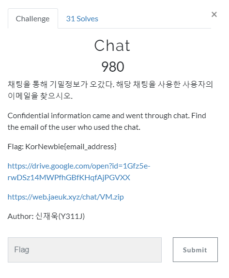
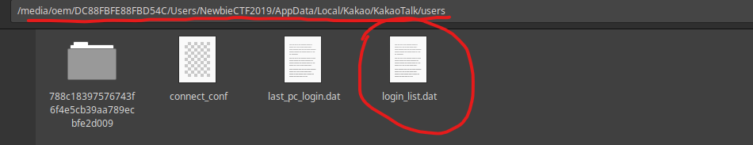
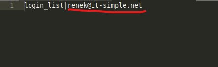

# Chat

## Task

## Solution

Here I was given the archive with virtual machine with Windows 10. First, I tried to run it, but it is password protected. So I mounted the `NewbieCTF2019_KakaoTalk.vmdk` to my Linux VM and digged through files. Finally I found this folder.

I looked into `login_list.dat` and found an email.

And the flag is `KorNewbie{renek@it-simple.net}`