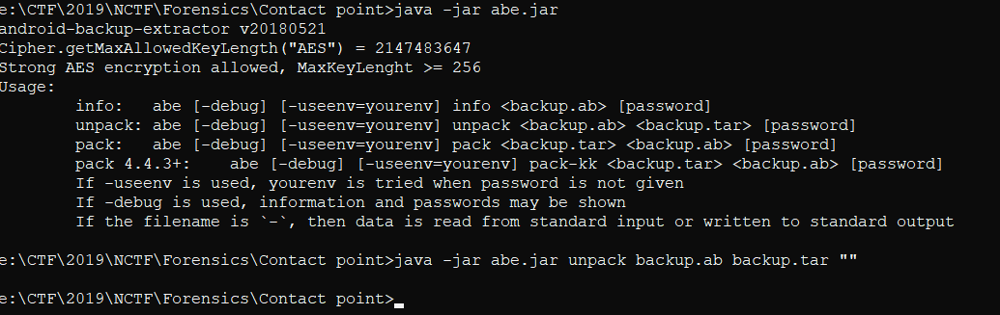

# Contact point

## Task

## Solution

Here I was given an android backup file [backup](./src/backup.ab). There is a tool ["abe"](./src/abe.jar) (aka "Android backup extractor"). So I used it and got the tar archive backup.tar.

After unpacking the archive I got lots of folders of applications' data. In the folder 'com.android.browser' I found the database.

Looking into the database I found the table with the browser's history and the flag.

So the flag is `KorNewbie{Jeju_international_airport}`