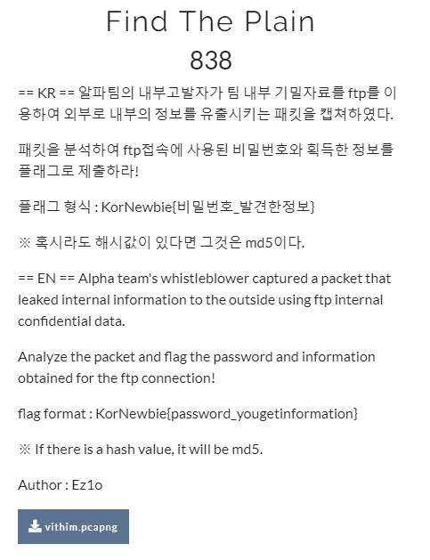
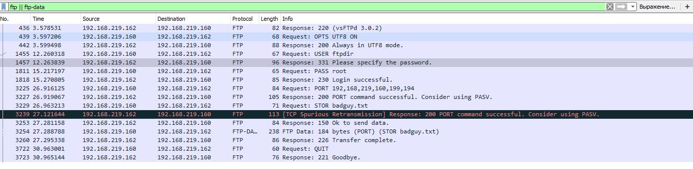
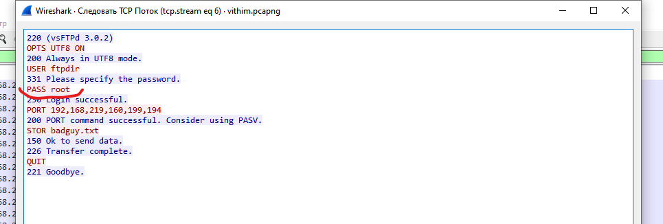
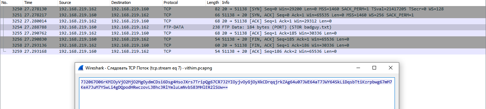
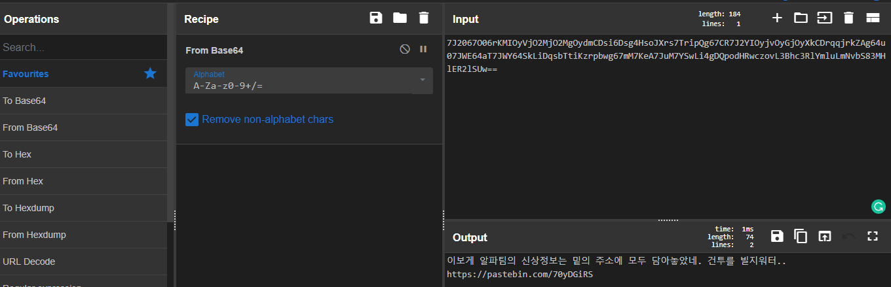
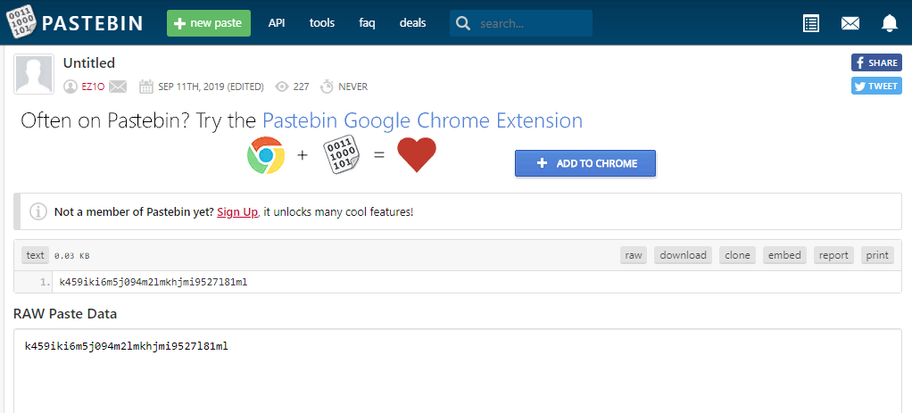
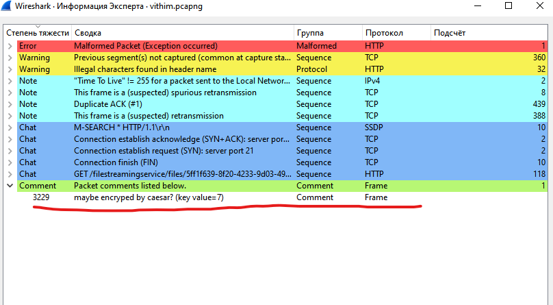
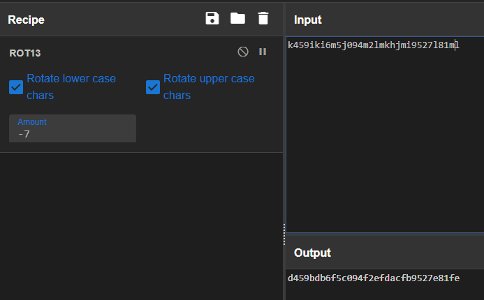

# Find the plain

## Task

[vithim.pcapng](./src/vithim.pcapng)

## Solution

Here I have the network traffic dump. I loaded it to Wireshark and used filter `ftp || ftp-data` as for in the task was said that data was sent with FTP.

Next, I followed the TCP stream and found the password.

Now I need to find the data. So I looked at FTP-DATA packet.

Here I see some Base64 encoded string. Decoding it...

Got the URL.

And now I have the data. But the system won't accept the flag `KorNewbie{root_k459iki6m5j094m2lmkhjmi9527l81ml}`. Seems like I did something wrong. Let's dig some deeper.

Looking at expert information I found this fascinating comment

Ok, now I decrypt the data

The flag must be `KorNewbie{root_d459bdb6f5c094f2efdacfb9527e81fe}`, although I can't check it because the CTF have been paused for a 15 hours by now =)
