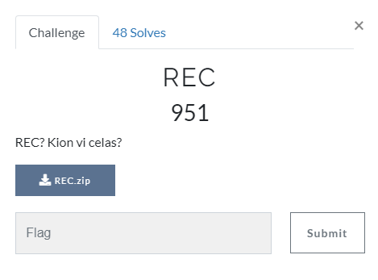
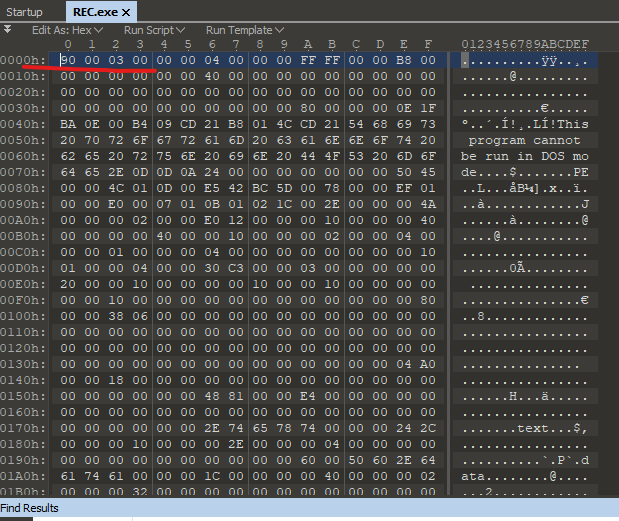
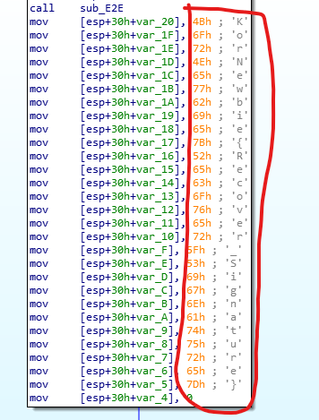

# REC

## Task

[REC](./src/REC.zip)

## Solution

After unpacking the archive I got a .exe file, but it is broken and won't be run by the system. So I looked at it's bytes and found out there was a broken header.

I fixed it and it won't run anyway =)

So I just opened it in IDA and watched through functions. Finally I found the following code.

The flag is `KorNewbie{Recover_Signature}`