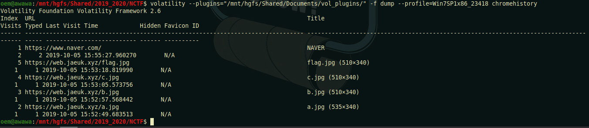

# Top Secret

## Task

After downloading and unzipping the archive I got the file named "Windows 7 Enterprise K-b94208dd.vmem". Seems like it's a job for Volatility Framework. So let's get started.

## Solution

First of all, I determine the profile of the dump. Well, actually, first of all, I have renamed the file to 'dump'. Just to make the name shorter.

Now that I know it's Win7SP1x86_23418, I can start to analyze the dump. Let's see the process list.

There are two processes I am most interested in. They are chrome.exe and notepad.exe (although there are some other processes I could look at). First, I wanted to look at chrome's history.

And here I found a few images, one of them is called flag.png. So that's must be something useful! But it's not, after looking at these images with stegsolve, exiftool and binwalk I found out these images are totally useless. So let's keep digging.

I decided to look at notepad.exe and dumped its memory. It took a while.

Next, I fetched `strings` from dump and used `grep "KorNewbie"`

The flag is `KorNewbie{OH..You_Know_B4sic_0F_M3mory_Forensics!}`