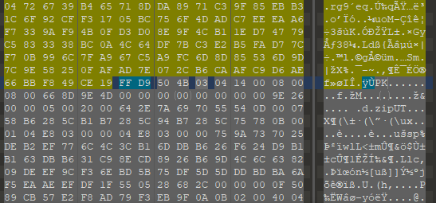
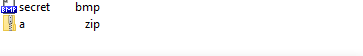
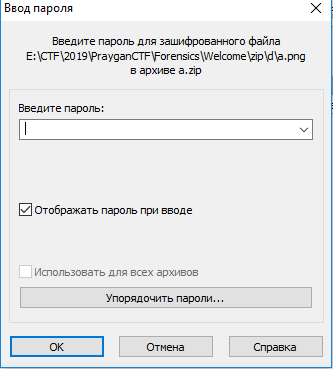
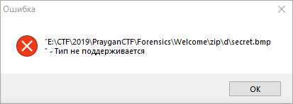
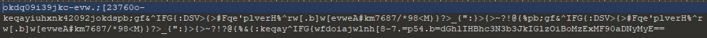
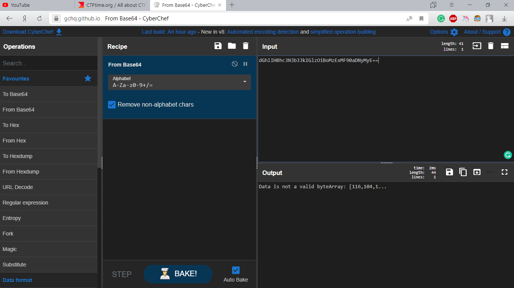
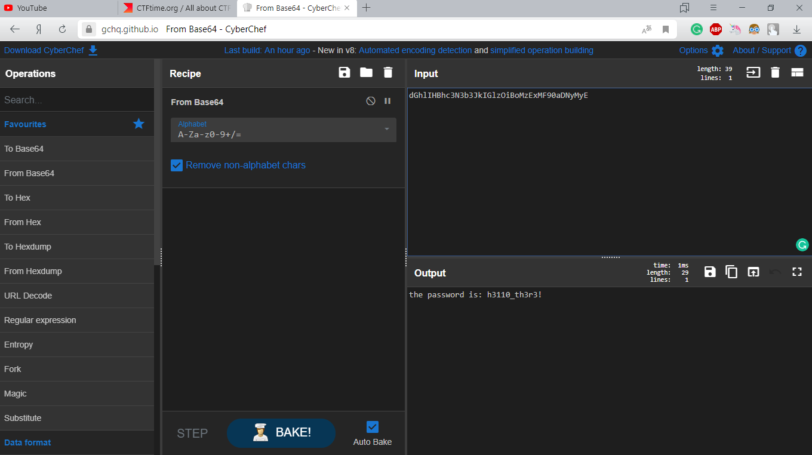
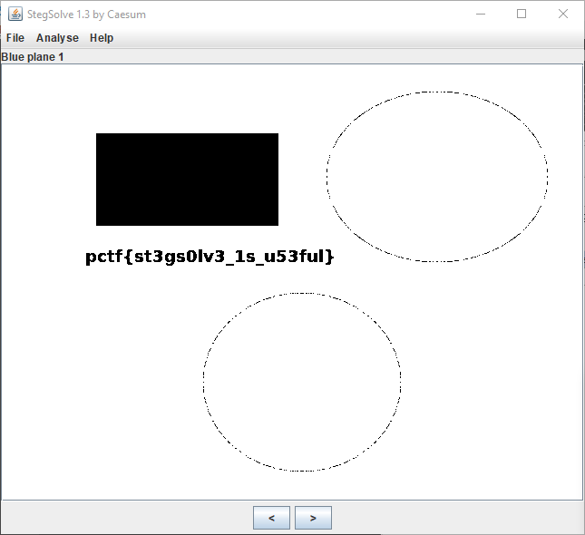

# Welcome

## Таска

Do you think this is a normal image? No! Dig deeper to find out more.....

## Решение

Такс, ну понятное дело, первым делом я загнал картинку в Stegsolve, но там ничего интересного не обнаружилось. Поэтому я решил взглянуть на неё в хексе. Вот там уже картинка повеселее:

Видим заголовок .zip архива. Аккуратно вырезаем архив и сохраняем в новом файлике. Распаковываем, а там еще один архив, ха. Распаковываем его тоже. А в нём... опять архив, но еще и secret.bmp.

Ну мы уж и не смотрим на секрет, а рвёмся распаковывать zip. А не тут-то было, архивчик-то запаролен:

Ну ладно, смотрим чё там в картинке:

Ой. Ясненько, смотрим хексы:

А это вообще не файл, каша какая-то. Но в конце есть кусочек подозрительно похожий на Base64. Декодируем, и:

Чё за... Так, спокойствие, а если убрать "==" с конца:

Во, а вот и пароль. Распаковываем архив и видим картинку:

Пихаем её сразу в Stegsolve и вуаля:

