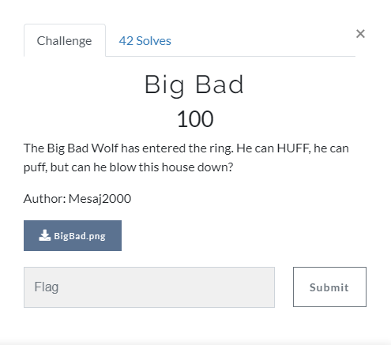
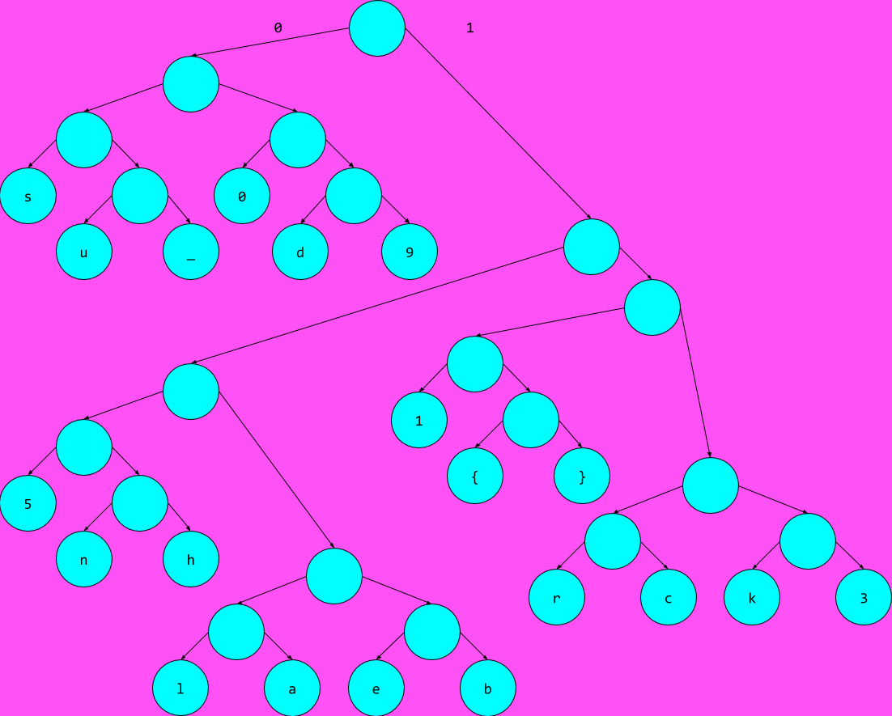
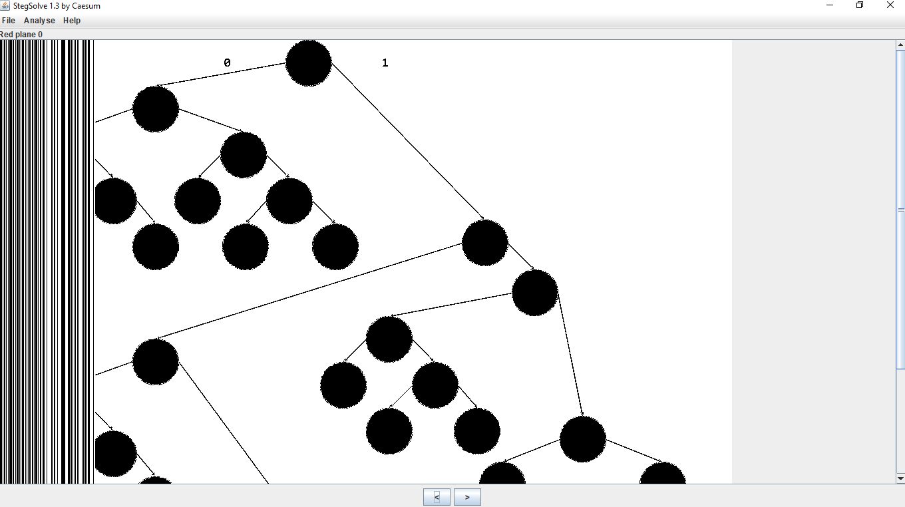
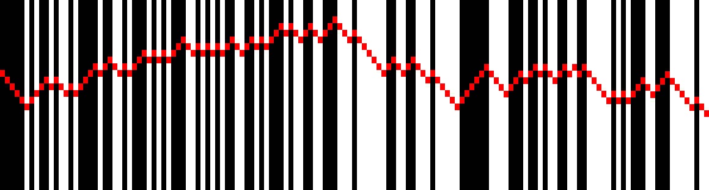

# Big Bad

English version coming soon

## Task

[BigBad](./src/BigBad.png)

## Solution

Открываем картинку:

Тут какое-то дерево. Внимательно читая задание, замечаем слово HUFF. Похоже, нам намекают на [кодирование методом Хаффмана](https://en.wikipedia.org/wiki/Huffman_coding). Только у нас нет данных, которые надо декодировать.

Поискать эти данные я решил внутри картинки. Открываем её Stegsolve'ом и находим вот такую штуку:

Так, на что это похоже? Может штрих-код? После некоторых несложных манипуляций я получил вот такую картинку:

Здесь красные точки я поставил для того, чтобы было легче посчитать ширину линий. Теперь всё это переводим в нули и единицы следующим образом: 

1) Ширина самой тонкой линии берется за эталонную ширину одного символа.

2) Чёрные полоски - это 0, белые - это 1

То есть первая черная полоска будет равна 00000, потому что её ширина равна 5 эталонным. Далее идёт 1, потом 0 и т.д. Декодируя таким образом весь штрих-код получаем такую строку:

`0000010100101101000010011010001010100011010101001100101000101100110001110111111001100111011111000000111100010010110011001111101010001100011111011`

Теперь, используя дерево на картинке, декодируем флаг в соответствии с правилами [кодирования Хаффмана](https://en.wikipedia.org/wiki/Huffman_coding) и получаем следующую строку: `sun{sh0ulda_u5ed_br1cks_1001130519}`
