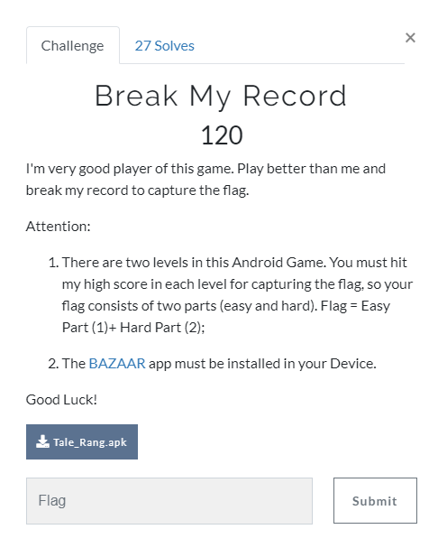
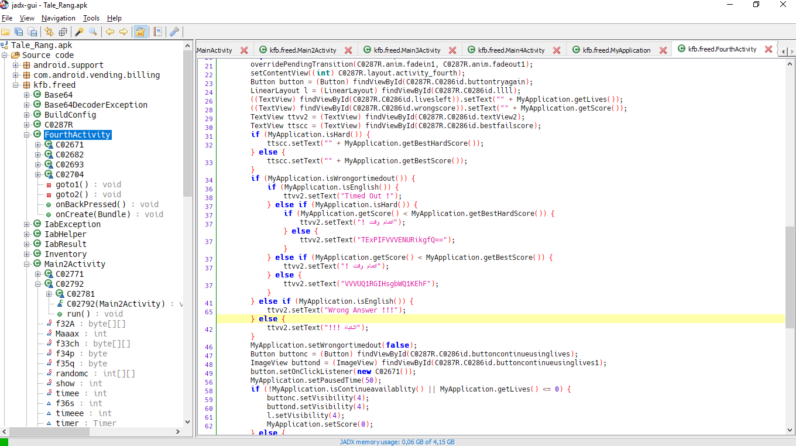
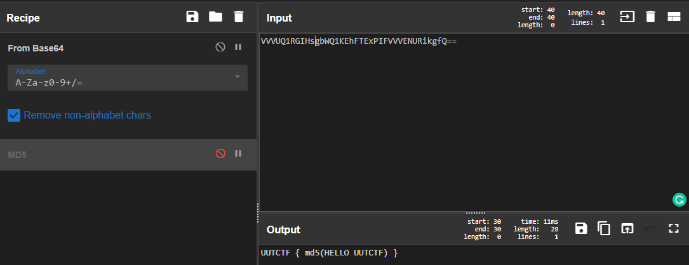

# Break My Record

## Task

[Tale_Rang.apk](./src/Tale_Rang.apk)

## Solution

I didn't wanna to install this app, so I just decompiled it with jadx. There are a lot of files with code, but I didn't analyze all of it, I just watched it through in order to find something interesting. And here it is! In FourthActivity if found the following code:

Seems like here your score compares to the best score. And if you scored more, base64 encoded flag will be printed.

Decoding the base:

UUTCTF{7c34446d10bbb60d0cae15059fffc98d}