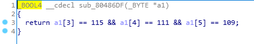

# CorrectPAss

## Task

[pass](./src/pass)

## Solution

We are given some binary. I don't wanna run it, but I wanna watch what's inside. So let's throw it to IDA.

What do we see? First, the program asks for input at line 10. After that the program checks if it's  being debugged. If it is, variable `v4` at line 15 will be 1, if it's not - 16. So we should not debug it. At line 15 the space for our input is being allocated, at line 16 it's filled with `0`. And at line 17 the program reads input from the stdin.

After that input goes through several checks, and if it passes all of them the programm will print the flag. Next I will analyze variables and functions and rename them just to make it easier to read the code.

Variables:

1) `v4` -> `input_length`
2) `s` -> `input`
3) `v0` -> as long as we know that input should be 16 symbols length, I can calculate the index 16 / 2 - 1 = 7. So I will rename it to `input_7`
4) `v1` -> `input_6`
5) `v2` -> `input_0`

Functions:

1) `sub_804858B`. Now let's watch it' source code:

The function takes two attributes and compares them. If they are equal, function will return their value, else - 1. So I will call it `comparison`

2) `sub_80485EA`:

This function is takes one argument, it should be some address because in the loop we see indexing. In the loop index is being incremented until the element in the memory not euqal `\n`. I suppose the idea of the function is to find the length of given string. So I call it `length`.

3) `sub_80485A2`:

At this function I see that v1 equals to 18 and it returns 5 * (18 + 1 (or 400)). So it returns 95 or 39710. I will call it `ret95`.

4) `sub_8048623`:

Here I see, that loop goes from 36 to 1, and given argument is being decreased by 1 or by 1094861568. I really don't think there will be 1094861568, so this function is actually made to calculate a1 - 35. So I name it `m36`.

Next 5 functions perform some checks for `input`, so I will call it `check1`, `check2`, `check3`, `check4` and `check5`.

Here how the code looks after refactoring:

Now let's analyze `checks`. At line 18 length of the input is being checked for equality to 16. At line 21 I found out that 7th symbol of the input should be 95, so it's `_`. And symbol at index 2 must be 101 -> `e`. Great! Moving on.

At line 24 I can see that input at index 6 must be equals to symbol at index 2. That's `e`. At line 27 I discover that first symbol of input must be 101 - 36 - 1 = 64 -> `@`. Well, that doesn't seem right. Later I found out that I made mistake and function `m36` is actually calculates a1 - 35, so 101 - 35 - 1 = 65 -> `A`. That's better.

Function `check1`:

We need this function to return 0. Now let's see what is going on here. First this function check if the length of input is equal to 16. It is, so it's fine. Next two operand reveals values of the input at indexes 11 and 12. Thats 33 -> `!`.

Function `check2`:

Extreamly easy one! Here I see that input[3] must be 115 -> `s`, input[4] = 111 -> `o`, input[5] = 109 -> `m`.

Function `check3`:

input[13] = 59 = `;`, input[14] = 45 = `-`, input[15] = 41 = `)`.

Function `check4`:

input[8] = 77 = `M`, input[9] = 48 = `0`, input[10] = 118 = `v`.

Function `check5`:

Knowing that input[2] = 101 and input[0] = 65 I can calculate `v1` = 101 - 65 + 83 = 119 = `w`. And I know that input[0] is not equal to input[4], so input[1] must be `w`.

Now combining all discovered symbols I know the input:

`Awesome_M0v!!;-)`

Lets' try it:

Great, so the flag to sumbit is: `UUTCTF{7e7d9d8d6a7ad4a2b3d0f0b4abc1d9bf}`
