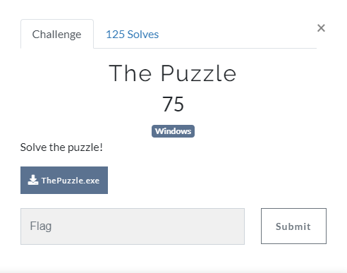
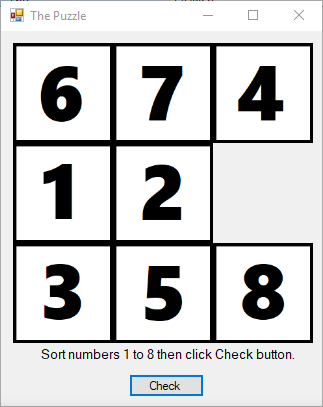
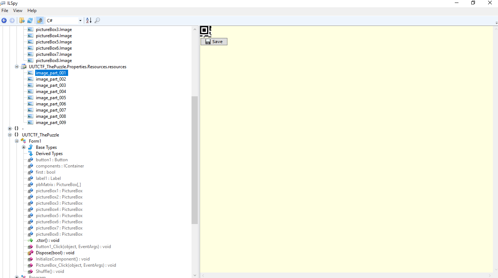
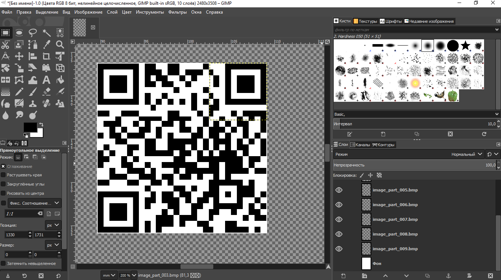
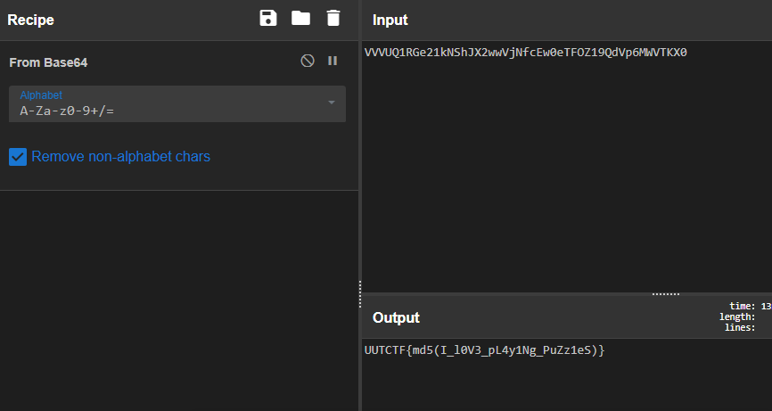

# The Puzzle

## Task



[ThePuzzle.exe](./src/ThePuzzle.exe)

## Solution

I tried to run the binary first. And here what I saw:



Alright, I need to sort the numbers. I didn't wanna solve this so I fed the binary to ILSpy to watch the sources. I looked for a function which processes the button click. Here it is:

```C#
private void Button1_Click(object sender, EventArgs e)
		{
			bool flag = true;
			for (int i = 0; i < 8; i++)
			{
				bool flag2 = this.pbMatrix[i / 3, i % 3].Name != "pictureBox" + (i + 1);
				if (flag2)
				{
					flag = false;
				}
			}
			bool flag3 = flag;
			if (flag3)
			{
				bool flag4 = this.first;
				if (flag4)
				{
					MessageBox.Show("Continue :)");
					for (int j = 0; j < 9; j++)
					{
						this.pbMatrix[j / 3, j % 3] = null;
					}
					this.pictureBox1.Image = Resources.image_part_001;
					this.pictureBox2.Image = Resources.image_part_002;
					this.pictureBox3.Image = Resources.image_part_003;
					this.pictureBox4.Image = Resources.image_part_004;
					this.pictureBox5.Image = Resources.image_part_005;
					this.pictureBox6.Image = Resources.image_part_006;
					this.pictureBox7.Image = Resources.image_part_007;
					this.pictureBox8.Image = Resources.image_part_008;
					this.Shuffle();
					this.label1.Text = "Sort again and then press Check button!";
					this.first = false;
				}
				else
				{
					this.pbMatrix[2, 2].Image = Resources.image_part_009;
					this.pbMatrix[2, 2].Size = new Size(100, 100);
					this.pbMatrix[2, 2].SizeMode = PictureBoxSizeMode.StretchImage;
					base.Controls.Add(this.pbMatrix[2, 2]);
				}
			}
			else
			{
				MessageBox.Show("Try Again!");
			}
		}
```

Seems like flag is being combined from 9 images. Those images are in the Resources, so I went to look at them.There are QR code splited into 9 parts:



So I extracted all parts and combined them to get full QR.



Scanning the code gives us flag(almost).



The flag is: `UUTCTF{9ad589e4c948c9ecd46bf2c55c3049b5}`