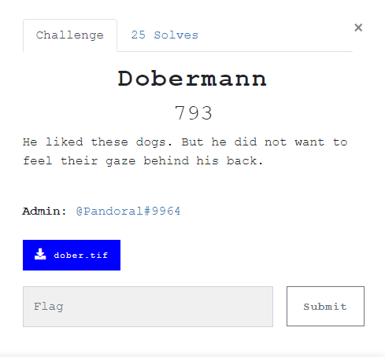
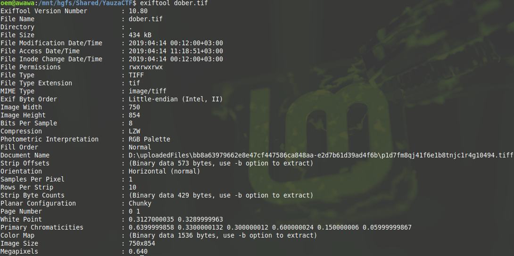
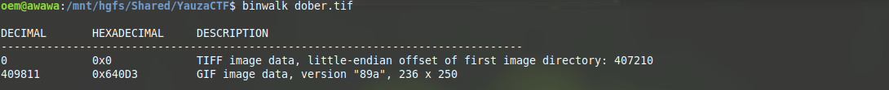
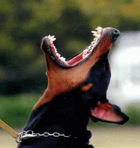
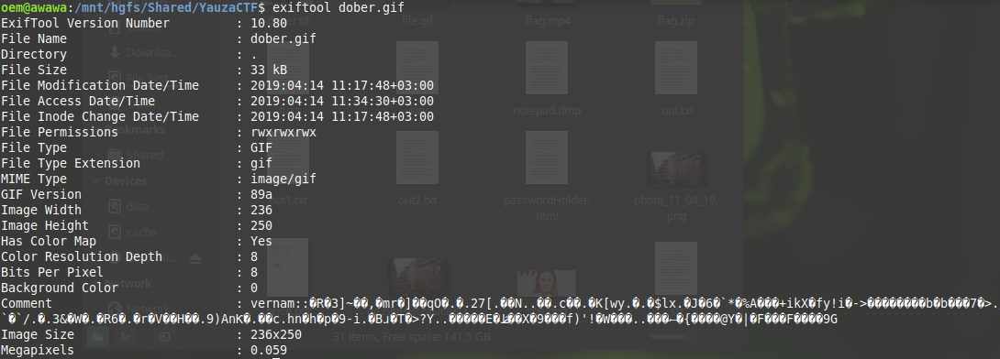
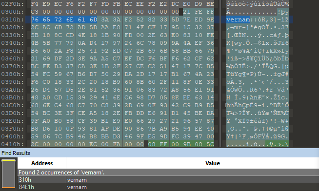

# Doberman

## Task



[dober.tif](./src/dober.tif)

## Solution

We are given a tif image. I don't know much about TIFF but, as well as it's an image, I started solution as for any image. First,, I passed it to exiftool to check if there is something interesting in metadata.



Seems like nothing. Moving on, next step - binwalk.



That's better. Extract that gif and here we go:



Same image but no text. Okay, now I start over with this gif.



Oh, look! There's an interesting comment. It says vernam and some bytes after that. Well, [Vernam](http://cryptowiki.net/index.php?title=Vernam_cipher) is a common known cipher. So it's probably a cipher text encrypted with it. But we still don't have a key, therefore I have to dig deeper. Now I thought about looking for the key in the image's bytes. I openned it it with 010Editor and searched 'vernam'.



There are two find results. Great, it's probably one for ciphertext and one for key. I exctracted [key](./src/key) and [ciphertext](./src/ciphertext) into two different files and made a script for decription:

```Python
with open("encrypted", 'rb') as f:
	data = f.read()
with open("key", 'rb') as f:
	key = f.read()

int_data = int.from_bytes(data, "big")
int_key = int.from_bytes(key, "big")
decr = int_data ^ int_key
decr = decr.to_bytes(decr.bit_length(), "big").strip(b"\x00")
print(decr.decode())
```

Running the script gives us the flag: `YAUZACTF{1n_5p3c_w3_7ru57}`