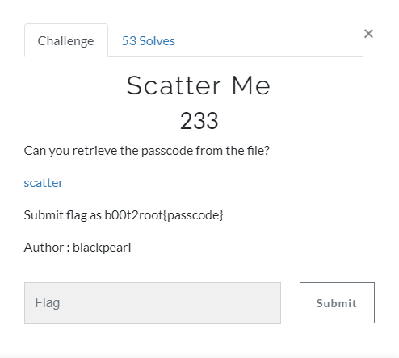
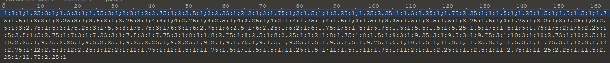
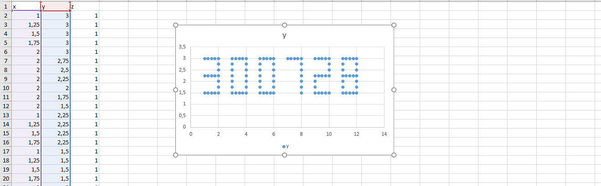

# Scatter Me

## Task

[scatter](./src/scatter)

## Solution

Too easy.
Let's look what's inside the scatter:

If you look closely you can see that there are triplets of numbers, separated by `;`. And third number always `1`. Looks like it't some coordinates. Let's try to build a graph:

And here's a passcode: `300728`. Wrap it into the flag format to pass: `b00t2root{300728}`