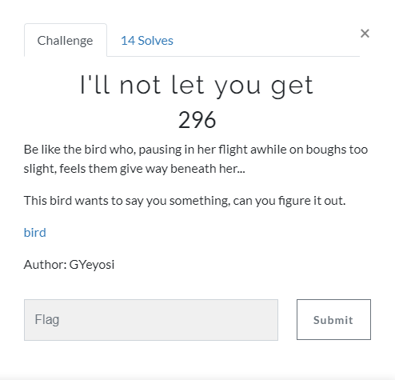
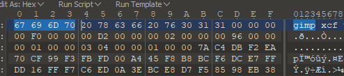
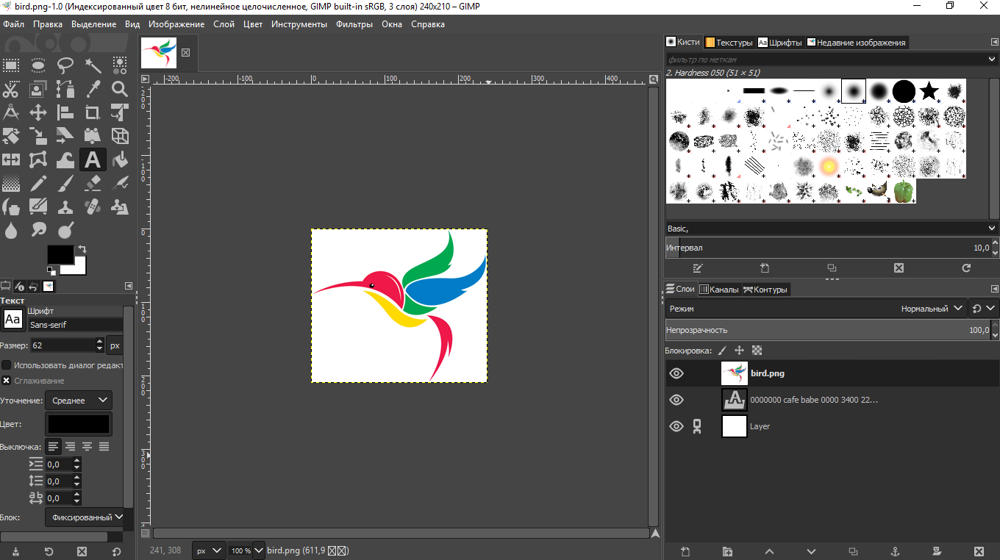
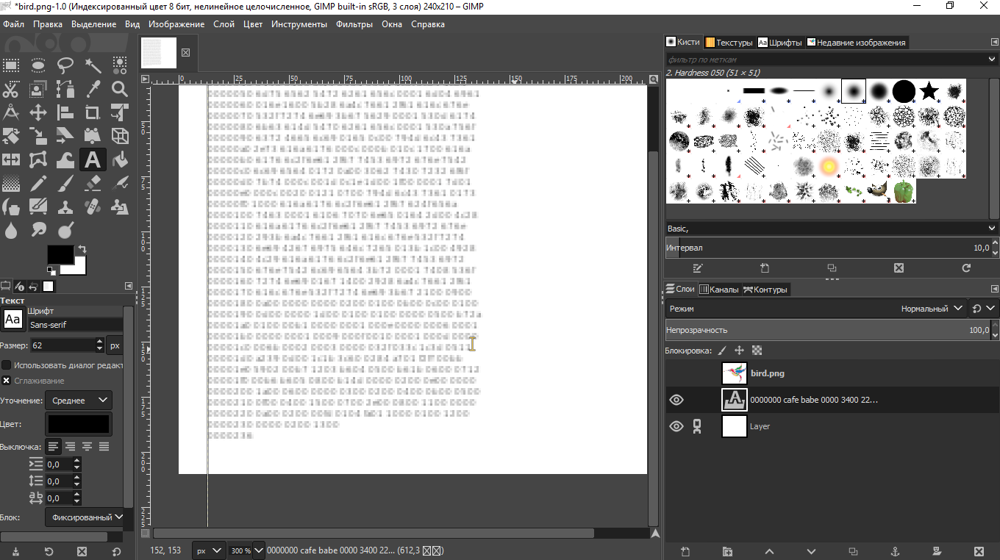
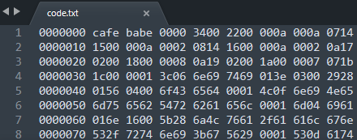
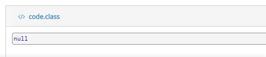
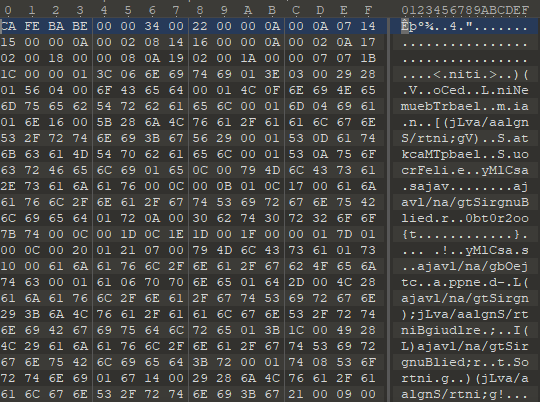
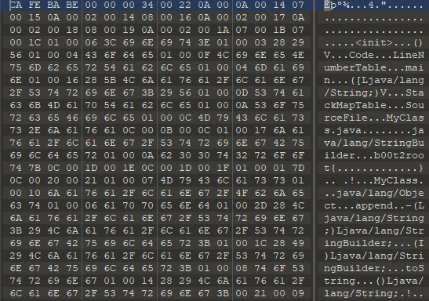
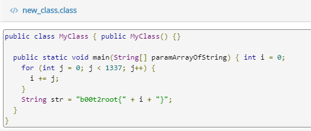
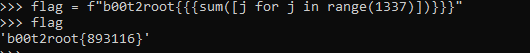

# I'll not let you get

[Русская версия](./README_ru.md)

## Problem



[bird](./src/bird.png)

## Solution

So we have the file wich looks like png, but it won't open. Opening it with 010Editor:



Aha, gimp. Okay, let's open it with Gimp:



Hey, and here's the bird! But we are more interested in something under the bird. Here we see some text:



I can't see anything here, but I can copy this text to the .txt file.



Okay, first, we see that it's some hex. Moreover, it's Java .class file (CAFEBABE header). Quickly coding small script to cut first column (it contains just adresses).

```Python
with open("code.txt", "r") as f:
	text = f.readlines()

new_text = []
for t in text:
	new_text.append("".join(t.split(" ")[1:]))
code = "".join(new_text).replace("\n", "")

with open("code.class", "wb") as f:
	f.write(bytes.fromhex(code))
```

Try to decompile this file wouldn't give us a thing:



Well, let's watch that hex again.



If you look closely, you can see that some bytes switched places with nearby byte (you can see it on the strings). Hmmm, so I need to recover it. But finding bytes, that are not on its place and move it back isn't a trivial task. After some more thinking I thought: what if it's not bytes that swapped, but it's columns of bytes. Now the problem seems easier.

Fine, now I need to find out what columns are swaped. That was actually easy. I just recovered strings. For example, instead of `niti` there should be `init`. So I need to swap 6 column with 7 columns and 8 with 9. Recovering other strings, I found out that we should swap all neighboring columns such as 0 with 1, 2 with 3, 4 with 5 and so on. But save the header, cause it's ok.

Here's a full script:

```Python
from textwrap import wrap

def swap(l, first, second):
	for i in range(len(l)):
		if len(l[i]) == 6 and max(first, second) > 5:
			continue
		temp = l[i][first]
		l[i][first] = l[i][second]
		l[i][second] = temp
	return l

with open("code.txt", "r") as f:
	text = f.readlines()

new_text = []
for t in text:
	new_text.append("".join(t.split(" ")[1:]))

lines = []
for line in new_text:
	lines.append(wrap((line).replace("\n", ""), 2))

new_lines = swap(lines, 0, 1)
new_lines = swap(new_lines, 2, 3)
new_lines = swap(new_lines, 4, 5)
new_lines = swap(new_lines, 6, 7)
new_lines = swap(new_lines, 8, 9)
new_lines = swap(new_lines, 10, 11)
new_lines = swap(new_lines, 12, 13)
new_lines = swap(new_lines, 14, 15)

new_lines[0][0] = 'ca'
new_lines[0][1] = 'fe'
new_lines[0][2] = 'ba'
new_lines[0][3] = 'be'

hex_code = "".join(["".join(i) for i in new_lines])

with open("new_class.class", "wb") as f:
	f.write(bytes.fromhex(hex_code))

```

At the and we have following hex:



Decompile it:



Here, just run this code to get the flag.



`b00t2root{893116}`