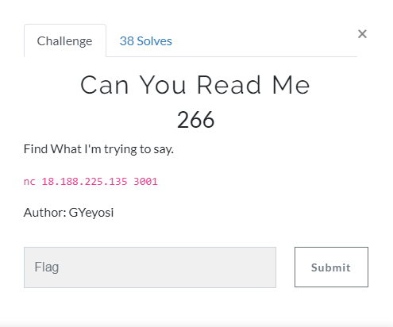
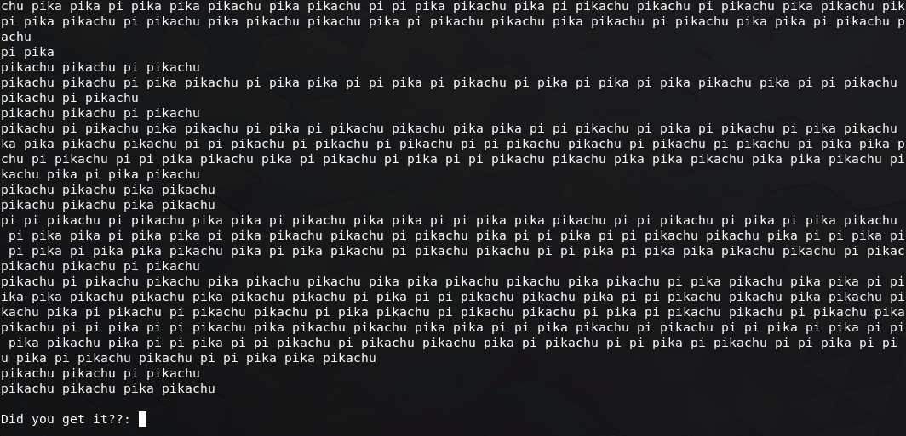
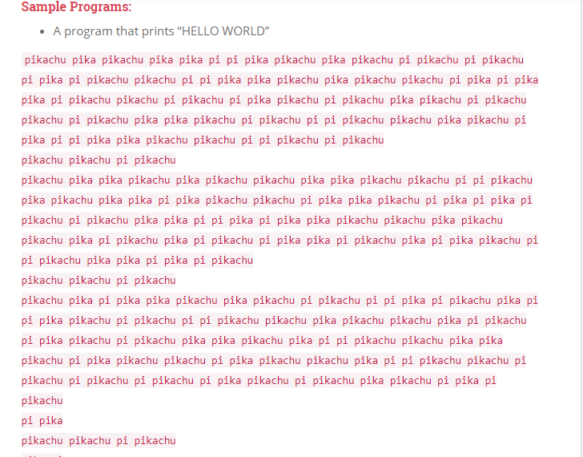
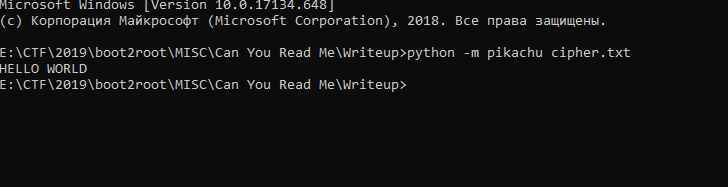
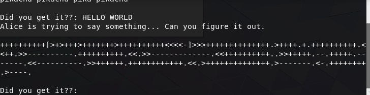
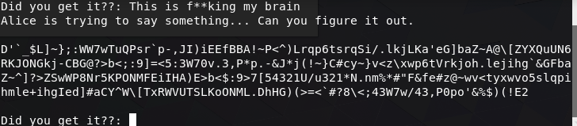
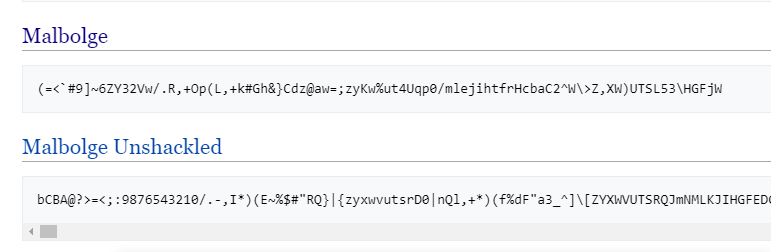
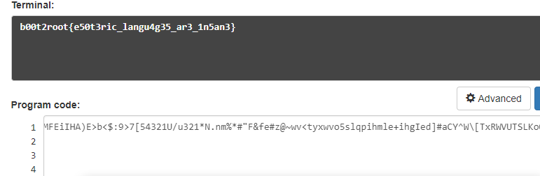

# Can You Read Me

## Problem

## Solution

So we are given nothing but the server address. Let's try and connect to it

My first thought was that this is some code. But then I thought about googling the pikachu language and here it is:

So this is a programm. After googling some interpreter I found this:
[pikachu-interpreter](https://github.com/joelsmithjohnson/pikachu-interpreter)

I installed it and executed the code:

Sending this to ther server and here is a round 2:

Well, that's easy one. Who doesn't know brainfuck? Executing it online:

And moving on to the last round:

Wow, that looks like some chaos. But, googling esotric programming languages gives us this:

Well, this is something similar to our string. Googling Malbolge interpreter and finding this:
 [Malbolge](http://malbolge.doleczek.pl)

And executing gives us  flag:

