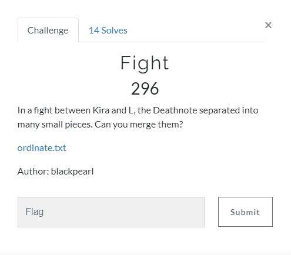
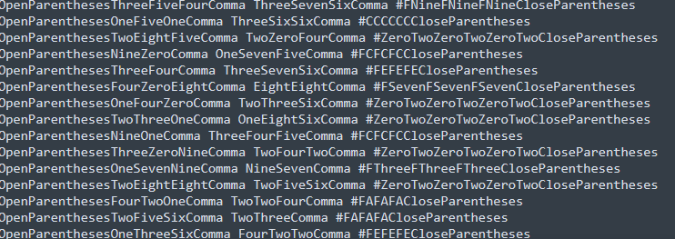
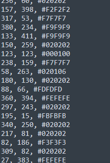

# Fight

## Task



[ordinate.txt](./src/ordinate.txt)

## Solution

We are given the text file. Let's look inside.



Here we can see thousands of rows. Every row consists by `OpenParentheses`, `CloseParentheses`, `Comma`, `numbers from 0 up to 9 written in words`, `#` and `hex numbers`. Let's try to replace words with characters with the following script:

```Python
with open("ordinate.txt", 'r') as f:
	data = f.read()

data = data.replace("OpenParentheses", '(')
data = data.replace("CloseParentheses", ')')
data = data.replace("Zero", '0')
data = data.replace("One", '1')
data = data.replace("Two", '2')
data = data.replace("Three", '3')
data = data.replace("Four", '4')
data = data.replace("Five", '5')
data = data.replace("Six", '6')
data = data.replace("Seven", '7')
data = data.replace("Eight", '8')
data = data.replace("Nine", '9')
data = data.replace("Comma", ',')
data = data.replace(')', '').replace('(', '').strip()
print(data)
```

And the output is:



Looks like pixels coordinates and color. I've written following script to build the image from this:

```Python
from PIL import Image
from textwrap import wrap

with open("ordinate.txt", 'r') as f:
	data = f.read()

data = data.replace("OpenParentheses", '(')
data = data.replace("CloseParentheses", ')')
data = data.replace("Zero", '0')
data = data.replace("One", '1')
data = data.replace("Two", '2')
data = data.replace("Three", '3')
data = data.replace("Four", '4')
data = data.replace("Five", '5')
data = data.replace("Six", '6')
data = data.replace("Seven", '7')
data = data.replace("Eight", '8')
data = data.replace("Nine", '9')
data = data.replace("Comma", ',')
data = data.replace(')', '').replace('(', '').strip()
dat = [i.split(',') for i in data.split('\n')]

for i in range(len(dat)):
	try:
		int(dat[i][0].strip())
	except:
		print()
coordinates = [(int(dat[i][0].strip()), int(dat[i][1].strip())) for i in range(len(dat))]
colors = [wrap(dat[i][2].replace('#', '').strip(), 2) for i in range(len(dat))]
width = max([coordinates[i][0] for i in range(len(coordinates))])
heigth = max([coordinates[i][1] for i in range(len(coordinates))])
print(width)
print(heigth)
img = Image.new('RGB', (width+1, heigth+1))
pixels = img.load()

for dot, color in zip(coordinates, colors):
 	pixels[dot[0], dot[1]] = (int(color[0], 16), int(color[1], 16), int(color[2], 16))

img.show()

```

And here is the image:

