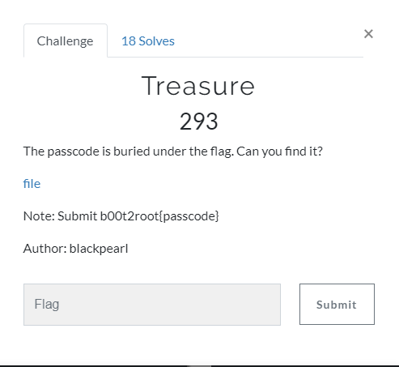
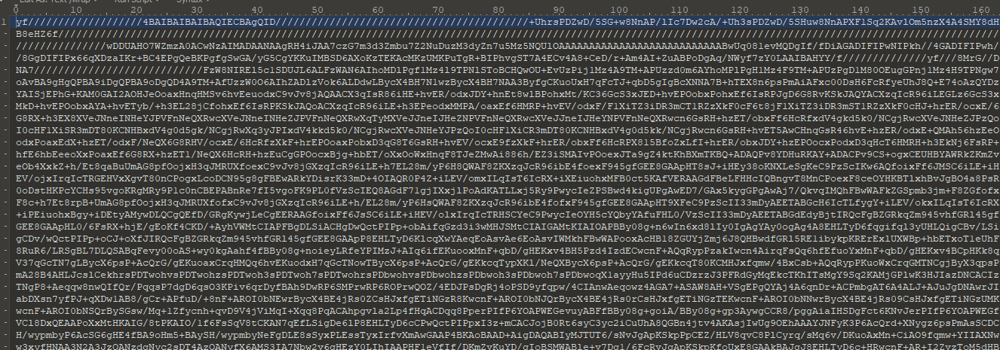
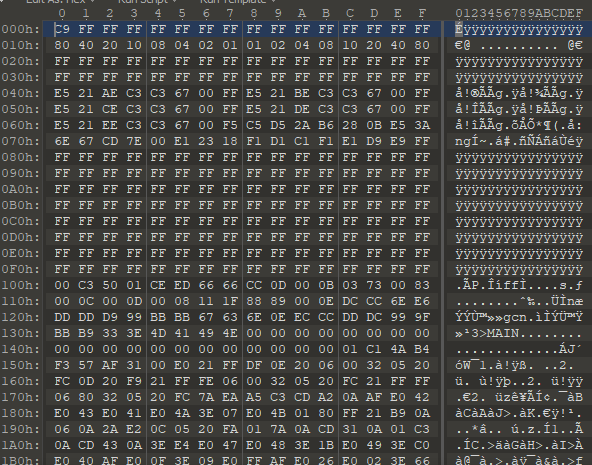
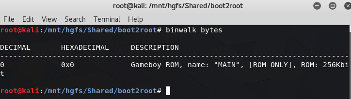
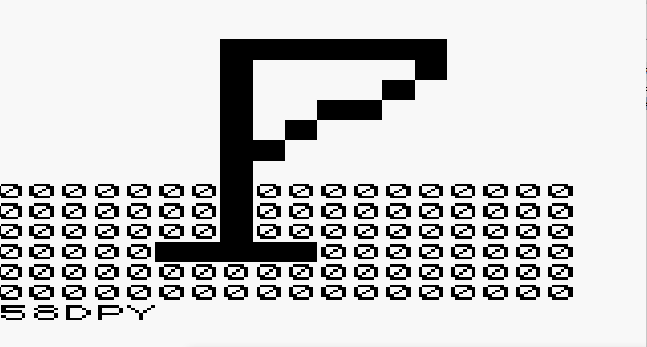

# Treasure

## Problem

[file](./src/treasure)

## Solution

Let's see what's inside the file:

It might be a bit unclear, but all this text is just a base64. So we can decode this and get a new file.

Looking into the new file didn't give me any hints about what is is, so I passed it to `binwalk`.

Ha, it's a game for GameBoy. I've download emulator and ran this.

The tasks says that passcode is under the flag, so it's 58DPY. Wrap it in flag format and here it is: b00t2root{58DPY}
